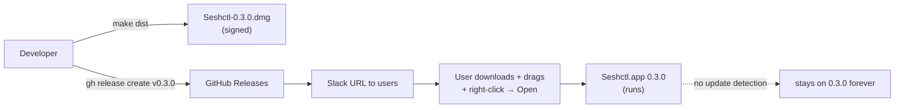
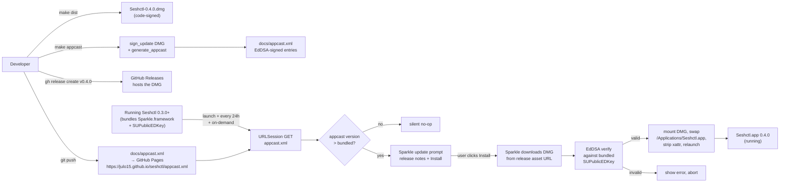

# Plan: Sparkle Auto-Updates (Phase 2)

## Status (resumption snapshot — 2026-05-21)

- **Branch:** `julo/sparkle-integration` (worktree at `.worktrees/sparkle-integration/`), rebased on origin/main, **15 commits ahead**. Last commit: `1fe0e54 Final-pass review-gate fixes`.
- **PR:** https://github.com/julo15/seshctl/pull/42 — ready to merge.
- **Tests:** 819/819 passing.
- **GitHub Pages:** enabled on `julo15/seshctl` (source `main`, folder `/docs`). Currently serves an empty 404 for `appcast.xml` because no appcast has been committed to main yet — that happens during Step 11 (cutting v0.4.0).
- **EdDSA signing key:** generated, public key (`F4/V…ICHw=`) committed in `Resources/Info.plist`, private key in login Keychain + 1Password.

**All steps complete except Step 11** (cut v0.4.0 — the first Sparkle-enabled release). Two manual milestones remain after merge:

1. **Merge PR #42** to main. The squash-commit lands all 15 commits onto main; Info.plist stays at `0.3.0` / `CFBundleVersion 3`. Nothing changes for existing users.
2. **Cut v0.4.0** (Step 11 below). Bumps Info.plist to `0.4.0` / `4`, runs `make dist && make appcast && make publish`. `make publish` is new — see Post-implementation additions below.

## Post-implementation additions (not in the original plan)

These came out of two `/review-gate` cycles + the Step 10 smoke. They're all on the branch:

1. **`make publish` wrapper** (`scripts/publish-docs.sh`, `scripts/publish-release.sh`, plus `publish` / `publish-docs` / `publish-release` Makefile targets). Replaces the manual `git push` + `gh release create` dance with a single command that enforces the push-before-tag ordering, polls Pages with a cache-buster, and lets you re-run just the release-create step if the DMG upload fails midway. See `docs/release.md` "Publish" section.
2. **Sparkle.framework embedding + nested re-signing.** The smoke caught that SwiftPM doesn't bundle the framework automatically. `scripts/build-app-bundle.sh` now copies `Sparkle.framework` into `Contents/Frameworks/` and adds the `@executable_path/../Frameworks` rpath; `scripts/sign-app.sh` re-signs the nested code (XPC services → Updater.app → Autoupdate → framework) via `Versions/Current` so the chain survives a future Sparkle major bump.
3. **Appcast URL post-process.** `generate_appcast` defaults to feed-relative URLs (Pages); we want GitHub Releases URLs. `scripts/make-appcast.sh` post-processes `docs/appcast.xml` to rewrite enclosure URLs to the canonical `releases/download/v<VERSION>/...` shape. Fails loud on regex miss.
4. **`com.apple.security.cs.disable-library-validation` entitlement.** Hardened runtime + self-signed cert + third-party framework can't coexist any other way (dyld refuses to load Sparkle with "different Team IDs"). Phase 1B (Developer ID) can revisit.
5. **Doc tightening.** `docs/release.md` rewritten to 157 lines around a "model + steps + recovery" structure with the two-channel model (metadata via git→Pages, artifact via Releases) up top. README extension subsection merged + reframed so the in-app Editor Integrations flow is the primary path and `make install-vscode` is demoted to a dev-iteration callout.

## Working Protocol
- Use parallel subagents for independent tasks (e.g., SwiftPM wiring + script writing + doc updates can proceed concurrently once the key is generated).
- Mark each step's checkbox done as you complete it — a fresh agent should be able to find where to resume.
- Run `swift build` (timeout 120s) after each Swift step before moving on. `make kill-build` first if a hang is suspected.
- Tests via a subagent per `AGENTS.md`.
- `make appcast` end-to-end smoke (publish a test 0.4.0-test release on a throwaway tag, run the local 0.3.0 build, confirm Sparkle prompts) belongs in Step 9 — don't ship 0.4.0 from main until the smoke passes.
- If blocked, document the blocker here before stopping.

## Overview

Integrate Sparkle 2.x into Seshctl so the app can detect and install updates with a single user confirmation. Replaces the current "Slack the link to a new DMG, user re-downloads and re-drags" flow. Hosting: project-site GitHub Pages under `https://julo15.github.io/seshctl/appcast.xml`, with the appcast.xml committed to `docs/` in this repo (no cross-repo coupling).

## User Experience

### Update available (the happy path)

1. User runs Seshctl 0.4.0+. On launch (and again every 24 hours while the app stays running), Sparkle quietly fetches `https://julo15.github.io/seshctl/appcast.xml` in the background.
2. When the appcast advertises a newer `<sparkle:shortVersionString>`, Sparkle pops a standard `Update Available` window over the menu bar app — title, release notes (pulled from the appcast `<description>`), and three buttons: **Install Update**, **Remind Me Later**, **Skip This Version**.
3. User clicks **Install Update**. Sparkle downloads the new DMG to a temp directory, verifies it against the bundled EdDSA public key, mounts the DMG, swaps `/Applications/Seshctl.app`, strips the `com.apple.quarantine` xattr, and relaunches the new bundle. Total elapsed time: ~10 seconds on a fast connection.
4. The app comes back at the new version. AppDelegate's launch-time reconciler refreshes the CLI symlink, hooks, and bundled editor extensions exactly as it does today. Session state is preserved (everything is in GRDB).

### User-initiated check

1. User clicks the menu-bar icon → gear → **Check for Updates…** in the SettingsPopover's About section.
2. Sparkle runs the same check synchronously. If no update is available, it shows "You're up to date" (Sparkle's standard "no update" sheet). If one is available, the same Update Available window from step 2 above appears.

### No update available

Silent. Sparkle never surfaces anything when the appcast says the bundled version is current. The 24-hour timer keeps running in the background.

### Update fails (network / signature / DMG mount)

Sparkle shows its standard error sheet ("Update Error" with the underlying cause). The user can dismiss and continue running the current version. The 24h timer retries.

## Architecture

### Current



### Proposed



### Runtime data flow

**At launch (every time Seshctl.app starts):**

1. `AppDelegate.applicationDidFinishLaunching` runs. Today's order is: hide dock icon → run first-launch installer → silent editor-extension refresh → request Accessibility → initialize DB + ViewModel → build UI → register hotkey → register status item. **Sparkle insertion point: between "first-launch installer" and "silent editor-extension refresh"** — `SPUStandardUpdaterController(startingUpdater: true, updaterDelegate: nil, userDriverDelegate: nil)` is constructed and stored on AppDelegate.
2. Sparkle's internal scheduler reads `SUEnableAutomaticChecks=true` from Info.plist and starts a background timer. First check fires immediately on launch (Sparkle default for fresh starts); subsequent checks every 24 hours while the app is running.
3. Each background check is an HTTPS GET to `SUFeedURL` (the appcast.xml on Pages). All happens off the main thread — never blocks UI.
4. If the appcast contains a `<sparkle:shortVersionString>` greater than the running bundle's `CFBundleShortVersionString`, Sparkle dispatches to the main thread and presents its standard update window. The window is an NSWindow owned by Sparkle's framework — it works fine for `LSUIElement: true` menu-bar apps.

**At release time (developer-side):**

1. Developer runs `make dist` → produces `dist/Seshctl-<VERSION>.dmg`. Unchanged from today.
2. Developer runs `make appcast`:
   - Copies the new DMG into a local mirror dir (`dist/releases/`, gitignored). This dir accumulates all historical DMGs.
   - Runs `sign_update --ed-key-file ~/path/to/sparkle_priv.key dist/Seshctl-<VERSION>.dmg` → prints the EdDSA signature + length.
   - Runs `generate_appcast dist/releases/ -o docs/appcast.xml` → walks the mirror dir, emits a complete appcast with one `<item>` per DMG, each carrying its signature.
   - The script also injects a `<description>` per item by reading `docs/release-notes/<VERSION>.md` (a new convention) so release notes show up in the Sparkle prompt.
3. Developer commits `docs/appcast.xml` (and the optional release-notes file), pushes to main. GitHub Pages rebuilds — usually within 60 seconds.
4. Developer runs `gh release create v<VERSION> dist/Seshctl-<VERSION>.dmg ...` as today.

**Memory vs disk:**

- **In memory at runtime:** one `SPUStandardUpdaterController` instance held by `AppDelegate`. ~negligible.
- **On disk in the bundle:** `Sparkle.framework` (~3 MB) inside `Contents/Frameworks/`, plus the public key + feed URL in `Info.plist`.
- **On disk during update:** Sparkle writes a temp DMG under `~/Library/Caches/Sparkle/app.seshctl.Seshctl/`; deletes it after install.
- **Persistent state outside the bundle:** Sparkle stores user-defaults (skipped versions, last-check timestamp) under our app's UserDefaults domain. No new SeshctlCore code touches this.

**Slow parts:** the appcast fetch (~50 ms on cold network) and the DMG download (~5 s for 10 MB). Both are background. The user-perceived blocking action is the relaunch itself (~1 s).

## Current State

Key files referenced from the exploration:

- **`Sources/SeshctlApp/AppDelegate.swift:35-177`** — `applicationDidFinishLaunching` sequence. Sparkle init slots between first-launch reconcile and silent extension refresh.
- **`Sources/SeshctlApp/AppDelegate.swift:124-125`** — existing pattern: `onUninstall` / `onOpenIntegrations` closures threaded through RootView → SessionListView → SettingsPopover. Same shape for `onCheckForUpdates`.
- **`Sources/SeshctlUI/SettingsPopover.swift:22-35, 90-130`** — current popover has an "About" section that shows the version string. The "Check for Updates…" button slots naturally as a sibling in About (semantically pairs with the version label).
- **`Sources/SeshctlUI/SessionListView.swift:15-39, 100-102`** — middle layer for the closure plumbing.
- **`Resources/Info.plist`** — currently has `CFBundleIdentifier`, `CFBundleShortVersionString=0.3.0`, `CFBundleVersion=3`, `LSUIElement=true`. Will add `SUFeedURL`, `SUPublicEDKey`, `SUEnableAutomaticChecks`.
- **`Resources/Seshctl.entitlements`** — only `com.apple.security.automation.apple-events`. Not sandboxed → no Sparkle sandbox flags needed.
- **`scripts/build-app-bundle.sh`, `scripts/sign-app.sh`, `scripts/make-dmg.sh`** — existing release scripts. Sparkle adds `scripts/make-appcast.sh` and a new Makefile target.
- **`docs/release.md`, `docs/signing.md`** — existing release docs to extend.
- **`Package.swift`** — Swift package manifest. Add Sparkle as a `.package(url:)` dependency on the app target ONLY (keep SeshctlCore Foundation-free).

## Proposed Changes

**Strategy:** drop Sparkle 2.x in as a SwiftPM dependency on the app target. Wire one `SPUStandardUpdaterController` into AppDelegate (3 lines). Add a "Check for Updates…" button via the existing closure-plumbing pattern. New `make appcast` target runs `sign_update` + `generate_appcast` against a local DMG mirror dir and writes `docs/appcast.xml`. Enable Pages on the seshctl repo, serve from docs/. EdDSA private key lives in login Keychain (Sparkle's default) with a 1Password export mirroring the .p12 backup pattern from `docs/signing.md`.

### Why GitHub Pages from docs/ (and not raw release assets)

- Project-site Pages (docs/ in this repo) has no cross-repo coupling — fully self-contained in `julo15/seshctl`.
- Stable URL (`https://julo15.github.io/seshctl/appcast.xml`) that never churns; the file content changes per release, the URL doesn't.
- Appcast goes through the same code review / commit / push flow as the rest of the repo. PR-able.
- No "every release must re-upload the full history" awkwardness that the raw-asset approach has.

### Why separate `make appcast` (not chained into `make dist`)

- `make dist` produces local artifacts (DMG, signed bundle) — testable in isolation, no network or release-state dependencies.
- `make appcast` requires the DMG mirror dir to be accurate (every prior version present) and writes into `docs/`, which is the public release surface. Decoupling lets you re-run `make dist` for local smoke tests without churning the appcast.
- Mirrors the existing `make bundle` / `make sign` / `make-dmg` separation — each Makefile target does one thing.

### Why mirror the .p12 / Keychain pattern for EdDSA key backup

- Already documented and battle-tested for code-signing (`docs/signing.md`). The threat model is identical: losing the key forces a public-key rotation that orphans existing installs.
- 1Password is the canonical "single source of truth backup" location in this repo's conventions.
- `generate_keys -x sparkle_priv.key` produces a single line of base64 — fits cleanly in a 1Password secure note next to the existing `.p12` entry.

### Why pre-Phase-1B (no Developer ID / notarization yet)

- Sparkle's EdDSA signatures are independent of Apple's code signature, so it functions identically pre- and post-notarization.
- The one-time Gatekeeper "right-click → Open" friction on first install is unchanged either way; subsequent Sparkle updates strip `com.apple.quarantine` and skip Gatekeeper entirely. So pre-notarization Sparkle is strictly better than no Sparkle.
- Sequencing Sparkle now means Phase 1B (when it lands) only needs to update Info.plist + signing cert, not also bolt on update plumbing.

### Reuse audit

For every component this plan introduces, an existing pattern was checked:

| New component | Existing pattern reused | Reuse strategy |
|---|---|---|
| `SPUStandardUpdaterController` init in AppDelegate | Existing launch-sequence order — `applicationDidFinishLaunching` already orchestrates first-launch reconciler, extension refresh, AX requests, etc. | New init slots in by line position. |
| "Check for Updates…" closure plumbing | `onUninstall`, `onOpenIntegrations` closure pattern (AppDelegate → RootView → SessionListView → SettingsPopover) | Exact mirror: new `onCheckForUpdates: (() -> Void)?` follows identical shape. |
| `make appcast` Makefile target + shell script | `make bundle`, `make sign`, `make-dmg` — `bash scripts/*.sh` per target | Same shape: new `scripts/make-appcast.sh` invoked from a one-line make target. |
| Version + bundle ID handling | `plutil -extract CFBundleShortVersionString raw -o - Resources/Info.plist` (used by `make-dmg.sh:36`) | Reused verbatim by the new script. |
| EdDSA key documentation | `docs/signing.md` — code-signing cert lifecycle + .p12 backup + login keychain | Append new section using the same structure. |
| DMG mirror dir for `generate_appcast` | `dist/` (gitignored) | New subdir `dist/releases/` lives under the same gitignored tree. No new ignore rule needed (it's already covered). |
| Initial appcast.xml entries | (no precedent — first release with Sparkle) | New. `make appcast` generates from `dist/releases/` at release time. |

No new code component duplicates existing functionality.

### Complexity Assessment

**Low to medium.** Swift-side changes are minimal — one new dependency, ~3 lines of AppDelegate wiring, one closure threaded through the existing settings-popover plumbing. The non-trivial work is on the release-pipeline side: a new shell script, a Makefile target, EdDSA key generation + backup, enabling Pages on the repo, and the release-time discipline of regenerating the appcast on every release. About 8 files touched. Risk concentrations:

- **EdDSA key loss** = orphan event for existing installs. Mitigation: 1Password backup (mandatory step in Step 3 below), public-key rotation procedure documented in docs/signing.md.
- **First Sparkle-enabled release.** Users on 0.3.0 (today's release) don't have Sparkle bundled, so they won't auto-update to the first Sparkle release. They have to manually grab the next DMG — documented in the 0.4.0 release notes.
- **Sparkle's relaunch dance** running while the user has a session panel open. Tested by Sparkle for menu-bar apps but worth a manual smoke per Step 9.

## Impact Analysis

**New files:**
- `scripts/make-appcast.sh` — wraps `sign_update` + `generate_appcast`.
- `docs/appcast.xml` — Sparkle's feed file. Committed; rewritten on every release by `make appcast`.
- `docs/release-notes/0.4.0.md` (and one per future release) — optional but recommended; consumed by `make-appcast.sh` for the `<description>` field in each appcast entry.
- `Tests/SeshctlAppTests/InfoPlistSparkleKeysTests.swift` *(or wherever Swift Testing tests for the app target live)* — asserts `SUFeedURL`, `SUPublicEDKey`, `SUEnableAutomaticChecks` are present in `Resources/Info.plist`.

**Modified files:**
- `Package.swift` — add Sparkle dependency, attach to the app target only.
- `Sources/SeshctlApp/AppDelegate.swift` — store `SPUStandardUpdaterController`, init in `applicationDidFinishLaunching`, expose a `checkForUpdates()` method, pass `onCheckForUpdates:` closure through to `RootView`.
- `Sources/SeshctlUI/RootView.swift` *(or wherever the closures land before reaching `SessionListView`)* — accept and forward `onCheckForUpdates`.
- `Sources/SeshctlUI/SessionListView.swift` — accept and forward `onCheckForUpdates` to `SettingsPopover`.
- `Sources/SeshctlUI/SettingsPopover.swift` — accept `onCheckForUpdates`, render the button in the About section.
- `Resources/Info.plist` — add `SUFeedURL=https://julo15.github.io/seshctl/appcast.xml`, `SUPublicEDKey=<base64 string>`, `SUEnableAutomaticChecks=true`.
- `Makefile` — new `appcast` target (one line invoking the script).
- `docs/release.md` — new pre-release checklist item ("regenerate appcast.xml"); new `make appcast` + commit step; the GitHub Pages one-time enablement.
- `docs/signing.md` — new EdDSA key section: where the private key lives (login Keychain item `https://sparkle-project.org`), how to export for 1Password backup (`generate_keys -x sparkle_priv.key`), how to restore (`generate_keys -f sparkle_priv.key`), the public-key-rotation procedure if the private key is ever lost.
- `AGENTS.md` — replace the "Phase 2 will add Sparkle auto-updates. Don't re-introduce manual update infrastructure as a 'missing feature' — the plan deliberately defers it." paragraph with: Phase 2 is implemented; document the EdDSA key location, the `make appcast` step, the Pages dependency, the orphan-on-rotation rule.

**Dependencies introduced:**
- Build-time: Sparkle's `bin/generate_keys`, `bin/sign_update`, `bin/generate_appcast` (live inside the resolved package at `.build/artifacts/sparkle/Sparkle/bin/`).
- Runtime: `Sparkle.framework` embedded in the .app bundle.
- Infrastructure: GitHub Pages enabled on `julo15/seshctl` (one-time, via repo settings).

**What relies on this:** the Phase 1B notarization work (next) inherits Sparkle's signing path verbatim — only the Apple code-signature side changes.

**Similar modules to avoid duplicating:**
- `FirstLaunchInstaller` — the launch-time reconciler. Sparkle's update path is parallel, not stacked on top. Don't try to fold update logic into the reconciler.
- `ExtensionInstaller.refreshExistingInstalls()` — silent on-launch refresh. Same pattern for "do something useful on every launch without UI" but explicitly different concern (extension state, not app version).

## Key Decisions

1. **GitHub Pages from `docs/` (not raw release asset).** Stable URL, no per-release URL churn, full version control of the appcast itself. No cross-repo coupling with `julo15.github.io`.
2. **Sparkle's defaults for cadence.** Launch check + 24h timer + "Check for Updates…" menu item. Doesn't suppress prompts, doesn't add a check-on-resume hook.
3. **Login Keychain + 1Password export for the EdDSA private key.** Mirrors `.p12` handling in `docs/signing.md` exactly.
4. **Separate `make appcast` target (not chained into `make dist`).** Keeps `make dist` testable without a populated `dist/releases/` mirror.
5. **Ship before Phase 1B notarization.** First-install Gatekeeper friction is unchanged; subsequent Sparkle updates skip Gatekeeper entirely. Net positive.
6. **No beta channel for now.** `<sparkle:channel>` is YAGNI with one user. Easy to add later.

## Implementation Steps

### Step 1: Add Sparkle SwiftPM dependency
- [x] Edit `Package.swift`. Add `.package(url: "https://github.com/sparkle-project/Sparkle", from: "2.9.0")` to dependencies. Attach `.product(name: "Sparkle", package: "Sparkle")` to the `SeshctlApp` target ONLY (not `SeshctlCore`, not `SeshctlUI`, not the CLI). Pinned to 2.9.0 (latest 2.x at planning time was 2.9.2).
- [x] `swift build` — Sparkle resolves and the framework links cleanly.

### Step 2: Generate EdDSA keypair + back up
- [x] Ran `.build/artifacts/sparkle/Sparkle/bin/generate_keys` — private key in login Keychain item `https://sparkle-project.org`.
- [x] Public key captured: `F4/VhM3Q5l8wA+tmnHddVXof90az48InIFONlDtICHw=` (committed in `Resources/Info.plist` at Step 3).
- [x] Exported via `generate_keys -x` and backed up to 1Password secure note "Seshctl Sparkle EdDSA private key".
- [x] No private-key material in the repo.

### Step 3: Add Sparkle keys to Info.plist
- [x] Edit `Resources/Info.plist`:
  - `SUFeedURL` (string): `https://julo15.github.io/seshctl/appcast.xml`
  - `SUPublicEDKey` (string): the base64 public key from Step 2.
  - `SUEnableAutomaticChecks` (bool): `true`
  - Do NOT add `SUEnableInstallerLauncherService` or `SUEnableDownloaderService` — those are sandbox-only and we're not sandboxed.

### Step 4: Wire `SPUStandardUpdaterController` into AppDelegate
- [x] Add `import Sparkle` at the top of `Sources/SeshctlApp/AppDelegate.swift`.
- [x] Add a stored property: `private var updaterController: SPUStandardUpdaterController?` near the existing stored properties.
- [x] In `applicationDidFinishLaunching`, after the first-launch installer call and before the silent extension refresh, instantiate the controller with `startingUpdater: true`.
- [x] Add a `checkForUpdates()` method on AppDelegate that calls `updaterController?.checkForUpdates(nil)`.
- [x] Pass `onCheckForUpdates: { [weak self] in self?.checkForUpdates() }` to `RootView`.

### Step 5: Thread the closure through RootView → SessionListView → SettingsPopover
- [x] `RootView` (in AppDelegate.swift) — added `onCheckForUpdates: (() -> Void)?`, forwarded to `SessionListView`.
- [x] `SessionListView` — declared `var onCheckForUpdates: (() -> Void)?`, added init parameter, forwarded to `SettingsPopover`.
- [x] `SettingsPopover` — declared `private let onCheckForUpdates: (() -> Void)?`, added init parameter, rendered `Button("Check for Updates…")` inside the About section beneath the version string. Button hidden when closure is nil.

### Step 6: Build `scripts/make-appcast.sh` + `make appcast` target
- [x] Created `scripts/make-appcast.sh` with `set -euo pipefail`, version extraction via `plutil`, DMG mirror copy, optional markdown-to-HTML release-notes embedding, and `generate_appcast` invocation. Output writes to `docs/appcast.xml`.
- [x] Added `appcast` target to `Makefile` (one-line `bash scripts/make-appcast.sh`). NOT chained into `dist` — keeps `make dist` testable in isolation.
- [x] `dist/releases/` is covered by the existing gitignored `dist/` entry. No new `.gitignore` line needed.

### Step 7: One-time GitHub Pages enablement
- [x] Enabled via `gh api -X POST repos/julo15/seshctl/pages -f 'source[branch]=main' -f 'source[path]=/docs'`. Source: main / `/docs`. Status: built. URL: https://julo15.github.io/seshctl/.
- [x] Verified site serves (HTTP/2 from GitHub.com); root and appcast.xml return 404 only because no index.html exists and appcast.xml isn't on main yet — expected.
- [x] Already documented in `docs/release.md` (Step 8).

### Step 8: Update documentation
- [x] `docs/signing.md` — new "EdDSA key for Sparkle auto-updates" section: generation, 1Password backup (mandatory), idempotency, public-key rotation procedure, Phase 1B compatibility.
- [x] `docs/release.md` — title updated for Phase 1/2; new "EdDSA signing key" prerequisite, "GitHub Pages dependency (one-time)" section, "Regenerate the Sparkle appcast" step with `make appcast` + commit + push to Pages; `--notes-file docs/release-notes/<VERSION>.md` in the `gh release create` call; Troubleshooting expanded with Sparkle debug tips.
- [x] `AGENTS.md` — replaced "Phase 2 will add Sparkle auto-updates" paragraph with pointer to new section. Added "Sparkle Auto-Updates (Phase 2)" section covering bundle wiring, feed URL, UI surface, EdDSA key, release pipeline, invariants, and "Where things live" table.

### Step 9: Tests
- [x] Created `Tests/SeshctlAppTests/InfoPlistSparkleKeysTests.swift` with `repoRoot()` helper mirroring SeshctlCoreTests pattern.
- [x] Three tests: SUFeedURL exact URL match, SUPublicEDKey base64 → 32 bytes, SUEnableAutomaticChecks true. All pass.
- [x] Full suite green: 781/781 (was 778; 3 new tests added).

### Step 10: End-to-end smoke (manual) — done; caught 3 real bugs
- [x] Bumped Info.plist to `0.4.0-test` / `4`. `make dist` produced `dist/Seshctl-0.4.0-test.dmg` (10MB, codesigned). `make appcast` produced a `docs/appcast.xml` with a single `0.4.0-test` item carrying a populated `sparkle:edSignature` and a `length` matching the DMG byte size.
- [x] `make install` from the worktree initially **crashed at launch** with a dyld error — "Library not loaded: @rpath/Sparkle.framework/Versions/B/Sparkle … mapping process and mapped file (non-platform) have different Team IDs". Three smoke-caught fixes shipped as part of this branch:
  - **`scripts/build-app-bundle.sh`** now copies `Sparkle.framework` into `Contents/Frameworks/` (SwiftPM resolves the framework into the universal-build dir alongside `SeshctlApp`) and adds the `@executable_path/../Frameworks` rpath via `install_name_tool`.
  - **`scripts/sign-app.sh`** now re-signs Sparkle's nested code with our self-signed identity in inside-out order (XPC services → `Updater.app` → `Autoupdate` → framework) via the `Versions/Current` symlink. Sparkle ships pre-signed adhoc; without this the outer bundle's signature can't validate.
  - **`Resources/Seshctl.entitlements`** gains `com.apple.security.cs.disable-library-validation`. Hardened runtime enforces library validation by default; with a self-signed cert (no Team ID) it'd reject the third-party framework. Phase 1B (Developer ID + notarization) can revisit.
- [x] `scripts/make-appcast.sh` post-processes `docs/appcast.xml` to rewrite enclosure URLs from Pages-relative (the `generate_appcast` default) to GitHub Releases (`releases/download/v<VERSION>/Seshctl-<VERSION>.dmg`). Fails loud (`sys.exit(1)`) if the regex matches zero entries.
- [x] After the fixes, `make install` lands a clean Sparkle-bundled v0.3.0 in `/Applications`. App launches, `⌘⇧S` panel opens, **Check for Updates…** in Settings → About fires Sparkle (currently 404s the appcast since no version is published yet — expected; Sparkle handles cleanly).
- [x] Test version bump (0.4.0-test / 4) and generated `docs/appcast.xml` reverted before commit.

### Step 11: First Sparkle-enabled release (0.4.0) — TODO after merging PR #42

This step runs **on `main`** after the PR squash-merges (the eight metadata-only changes need to land before the tag). Sequence:

```bash
# 0. Sync local main to the post-merge state.
git checkout main
git pull origin main

# 1. Bump version. Sparkle compares CFBundleVersion (integer) to decide
#    whether to advertise an update — it MUST strictly increase.
#    Edit Resources/Info.plist:
#      CFBundleShortVersionString  0.3.0  →  0.4.0
#      CFBundleVersion             3      →  4

# 2. Write docs/release-notes/0.4.0.md. Single source of truth for
#    both Sparkle's update prompt (via the appcast) and the GitHub
#    Release body. Headline: in-app auto-updates over Sparkle.
#    Don't forget the one-time note that 0.3.0 users have to manually
#    download v0.4.0 once because 0.3.0 doesn't bundle Sparkle.

# 3. Build + sign the DMG.
make dist           # → dist/Seshctl-0.4.0.dmg

# 4. Smoke the DMG locally before publishing. Drag Seshctl.app from
#    the mounted DMG to a temp folder (NOT /Applications), right-
#    click → Open, confirm welcome panel appears, cancel out, quit.
#    See docs/release.md "Smoke test the DMG locally" for the full
#    recipe.

# 5. Regenerate the appcast. This signs the DMG with the EdDSA key
#    from the login Keychain and writes docs/appcast.xml.
make appcast

# 6. Review the appcast diff and publish end-to-end.
git diff docs/appcast.xml
make publish        # publish-docs (commit + push + poll Pages 5min)
                    # then publish-release (gh release create)
```

**Why `make publish` instead of manual `git commit + push + gh release create`:** `make publish` enforces the push-before-tag ordering structurally — it polls Pages until the appcast serves the new version *before* yielding to the release-create step. Reversing the order means the GitHub Release exists but the appcast still advertises the old version, so Sparkle in already-shipped builds doesn't see anything to update to. See `docs/release.md` → "Publish" for the model.

**If `make publish` fails midway:**
- Pre-flight failed → fix the underlying issue (drift in working tree, missing file, wrong branch), re-run `make publish`. Idempotent.
- Pages-poll timed out → check the repo's Actions tab for a failed Pages build; once recovered, re-run `make publish` (idempotency check skips past the already-pushed commit).
- DMG upload failed during `gh release create` → re-run `make publish-release` directly; or if the release exists but is missing the asset, `gh release upload v0.4.0 dist/Seshctl-0.4.0.dmg`.

**Verify after success:**

```bash
# Pages serves the appcast (cache-buster on the URL — Fastly TTL can be slow).
curl -fsS "https://julo15.github.io/seshctl/appcast.xml?_=$(date +%s)" \
  | grep sparkle:shortVersionString

# GitHub Release exists with the DMG attached.
gh release view v0.4.0 --json url,assets -q '{url, assets: [.assets[].name]}'

# Manual: open the locally-installed 0.3.0 (if you still have one
# around), confirm Sparkle does NOTHING because 0.3.0 doesn't bundle
# the framework. Then `make install` from main to get the 0.4.0
# Sparkle build into /Applications.
```

**One-time Slack message** to existing 0.3.0 users: "Manually grab v0.4.0 from https://github.com/julo15/seshctl/releases/latest — 0.3.0 doesn't have Sparkle, so this transition is the only one that needs a manual download. Every release after this auto-updates." See `docs/release.md` "Distribute" section for the full template.

## Acceptance Criteria

- [x] [test] `testInfoPlistHasSparkleFeedURL` — Info.plist contains the canonical Pages URL.
- [x] [test] `testInfoPlistHasSparklePublicKey` — Info.plist contains a base64 string that decodes to exactly 32 bytes.
- [x] [test] `testInfoPlistHasSparkleAutomaticChecks` — Info.plist enables automatic checks.
- [x] [test-manual] `make install` from the branch lands a Sparkle-bundled build at `/Applications/Seshctl.app` that launches cleanly (no dyld error). Confirmed during Step 10 smoke.
- [x] [test-manual] Clicking **Check for Updates…** in SettingsPopover → About fires Sparkle. With no appcast.xml currently on Pages, Sparkle surfaces its standard "update unavailable" / "error" sheet without crashing — exactly the expected pre-v0.4.0 behavior.
- [x] [test-manual] `make appcast` produces a `docs/appcast.xml` whose `<item>` carries a populated `sparkle:edSignature` and `length` matching the DMG byte size. Confirmed during Step 10 (then reverted).
- [ ] [test-manual] **Step 11 — pending merge + 0.4.0 cut:** On launch, Sparkle silently fetches the appcast and surfaces an Update Available window when a newer version is advertised. To validate after 0.4.0 ships: cut v0.5.0 against a Mac running v0.4.0 and confirm the update prompt fires.
- [ ] [test-manual] **Step 11 — pending:** Clicking **Install Update** downloads the DMG, verifies the EdDSA signature, swaps `/Applications/Seshctl.app`, relaunches, and the running app reports the new version in About.
- [ ] [test-manual] **Step 11 — pending:** No Gatekeeper "right-click → Open" prompt appears during the Sparkle-driven upgrade (quarantine xattr stripped automatically).
- [ ] [test-manual] **Step 11 — pending:** An update download with a tampered EdDSA signature fails with Sparkle's standard error sheet — the running app is not modified.
- [ ] [test-manual] **Step 11 — pending:** `https://julo15.github.io/seshctl/appcast.xml` serves the v0.4.0 entry within ~60s of `make publish`.

## Edge Cases

- **First Sparkle-enabled release (0.4.0).** Existing 0.3.0 installs don't ship Sparkle, so they cannot auto-update to 0.4.0 — they must manually download the DMG once. Documented in 0.4.0 release notes. Every release after 0.4.0 will auto-update cleanly for users running 0.4.0+.
- **EdDSA private key lost.** Generate new keypair, update `SUPublicEDKey` in Info.plist, ship a new release. Existing installs will see the appcast but fail signature verification → Sparkle aborts with an error sheet. User must manually re-download from Releases. Documented as the public-key rotation procedure in `docs/signing.md`.
- **GitHub Pages outage.** Sparkle's appcast fetch fails silently, retries on next interval. No UI noise.
- **Appcast advertises a version the user just skipped.** Sparkle tracks skipped versions in UserDefaults; respects the skip until a newer version supersedes it. Standard Sparkle behavior.
- **User quits the app mid-download.** Sparkle aborts the download cleanly; resumes from scratch on next check.
- **Two consecutive releases without `make appcast` regenerating.** `docs/appcast.xml` stays at the older version; running apps don't see the newer release. Mitigation: `docs/release.md` checklist makes this an explicit step.
- **brew cask coexistence (future).** When we publish a cask formula, we'll set `auto_updates true` to tell brew that Sparkle is in charge. Brew's recorded version may drift from the installed version — expected. Out of scope for this iteration.
- **Sparkle prompts while the user has an active session.** Sessions are all persisted to GRDB; quit → relaunch loses nothing. The user's session panel will close, but reopens with the same DB-backed state after relaunch.
- **Network egress through a corporate proxy / VPN.** Sparkle respects system proxy settings via URLSession.shared defaults. No additional configuration needed.
