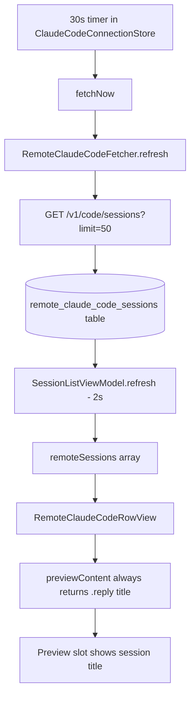

# Plan: Remote Row Recap (claude.ai assistant text as preview)

## Working Protocol
- Use parallel subagents for independent tasks (reading, searching, implementing across files).
- Mark steps done as you complete them — a fresh agent should be able to find where to resume.
- Run `swift test` (30s timeout) via a subagent after each step. If a build/test hangs, immediately run `make kill-build` before retrying.
- Build timeout is 120s, test timeout is 30s (per `AGENTS.md`).
- If blocked, document the blocker here before stopping.

## Overview

Surface the latest assistant message from each pure-remote (claude.ai Cowork) session as the row's preview text, mirroring the local-side `away_summary` slice shipped in PR #43. Plumbs into the existing `PreviewContent.awaySummary` case so remote rows light up the same clock-glyph + primary-color rendering that local Claude rows already get. No new UI; new wiring in the connection store that lazily fetches `/v1/code/sessions/<id>/events?limit=10` per session, keyed on `last_event_at`.

Background and field-by-field discovery in [`.agents/brainstorms/2026-05-21-1200-remote-row-recap-research.md`](../brainstorms/2026-05-21-1200-remote-row-recap-research.md); cost model in [`.agents/scratch/remote-recap-cost-model.html`](../scratch/remote-recap-cost-model.html).

## User Experience

1. User opens the Seshctl panel with a claude.ai connection. The remote-session list refreshes (30s cadence via `ClaudeCodeConnectionStore.startPeriodicFetching`).
2. For each pure-remote row whose session has at least one assistant turn, the row's preview slot — currently `title` rendered via `.reply(title)` — switches to the **first non-empty line of the most recent assistant message**, rendered with the same clock-glyph-led `.awaySummary` typography (15pt `.title3`, primary color, bold on unread) the local Claude rows already use for `away_summary` recaps.
3. For pure-remote rows with no assistant turn yet (brand-new sessions) or where the events fetch hasn't completed yet (first ~1s after panel open), the preview falls through to the existing `.reply(title)` — graceful degrade.
4. **Bridged rows** (`environment_kind == "bridge"`) are unaffected. The row a user sees for a bridged session is the *local* twin (its `RemoteClaudeCodeSession` is hidden by `BridgeMatcher`), and the local twin already gets its own `away_summary` from the JSONL transcript. We do not double-fetch.
5. When a remote session gets a new assistant turn, the next list-refresh cycle (≤30s) detects the advanced `last_event_at` and triggers a per-session events fetch. The row updates as soon as the fetch completes.
6. On app launch with N pre-existing remote sessions, all N events fetches fire in parallel from the first `fetchNow()`. Recaps populate over 1–2 seconds; the user sees rows transition from `.reply(title)` to `.awaySummary(...)` as fetches return.

## Architecture

### Current (post-PR-43)



Today's preview chain for remote rows is a single hop: `RemoteClaudeCodeSession.previewContent` is hard-coded to `.reply(title)`. The `.awaySummary` case is wired defensively in the row view's exhaustive switch but is unreachable because no upstream caller passes a non-nil summary.

### Proposed

```mermaid
flowchart TD
  Timer30[30s timer in ClaudeCodeConnectionStore] --> FetchNow[fetchNow]
  FetchNow --> ListFetch[fetcher.refresh]
  ListFetch --> ListAPI[GET /v1/code/sessions?limit=50]
  ListAPI --> DB[(remote_claude_code_sessions table)]
  ListAPI --> Diff{For each session:<br/>cache lastEventAt &lt; new?}
  Diff -->|yes / new| Dispatch[Task fetcher.fetchLatestAssistantText id]
  Diff -->|no| Skip[Skip - keep cached summary]
  Dispatch --> EventsAPI[GET /v1/code/sessions/id/events?limit=10]
  EventsAPI --> Parser[RemoteEventsParser.extractLatestAssistantText]
  Parser --> CacheUpdate[Update cache and remoteAwaySummariesById]
  CacheUpdate --> Publish[@Published map]
  DB --> VMRefresh[VM.refresh 2s reads DB]
  VMRefresh --> RemoteRows[remoteSessions]
  Publish --> RowView[RemoteClaudeCodeRowView awaySummary param]
  RemoteRows --> RowView
  RowView --> PreviewOverload[session.previewContent awaySummary]
  PreviewOverload --> Render[Clock glyph + assistant text]
```

**Runtime walkthrough.**

1. `ClaudeCodeConnectionStore` already runs `fetchNow()` every 30 seconds via `startPeriodicFetching`. After the list call returns and the DB is upserted (existing behavior), iterate the returned `[RemoteClaudeCodeSession]`.
2. For each session, compare `session.lastEventAt` against `remoteAwaySummaryCache[session.id]?.lastEventAt`. If the cache is absent or stale, AND no in-flight fetch is already running for that id, dispatch a `Task` that calls `fetcher.fetchLatestAssistantText(sessionId:)`.
3. The fetcher method issues `GET /v1/code/sessions/<id>/events?limit=10` with the same auth/header set the existing `refresh()` uses, parses the response body with `RemoteEventsParser.extractLatestAssistantText(eventsResponseData:)`, and returns `String?`.
4. The parser walks `data[]` newest-first, picks the first event with `event_type == "assistant"`, extracts the first `payload.message.content[]` block where `type == "text"`, and applies `trimmedPreviewBody` semantics (trim wrapper whitespace, preserve internal newlines, return nil if empty).
5. On the Task's MainActor continuation, write `(session.lastEventAt, summary)` into `remoteAwaySummaryCache[id]` and update the `@Published var remoteAwaySummariesById: [String: String]` (entries with nil summary are absent from the map).
6. `RemoteClaudeCodeRowView` reads the per-id summary from the connection store at the row's construction site (`SessionListView.swift`, `SessionTreeView.swift`) and passes it via a new `awaySummary: String?` init param. The view calls `session.previewContent(awaySummary: awaySummary)`, picking up the new `.awaySummary(text)` case which renders via the clock-led path the local side already established.
7. Cache eviction: after each `fetchNow()` completes, prune `remoteAwaySummaryCache` to only the IDs in the latest list. Drop in-flight set entries on completion (success or failure). On a failed fetch, do **not** retry until `last_event_at` advances — failures self-heal on next activity.
8. Bridged sessions are filtered out by `BridgeMatcher` before they reach the row view, so an events fetch firing for a bridged remote id is wasted work but not user-visible. (Optional optimization — see Edge Cases.)

**What lives where.**

| Concern | Owner | Why |
|---|---|---|
| Network call to `/events` | `RemoteClaudeCodeFetcher` (actor) | Same auth/header surface as `refresh()`. New method, same protocol. |
| Cache + `@Published` map | `ClaudeCodeConnectionStore` (MainActor) | Already owns the fetcher and the 30s timer; natural dispatch point. |
| Per-event parsing | `RemoteEventsParser` enum in `SeshctlCore` | Mirrors `TranscriptAwaySummaryScanner` shape; pure Foundation, AppKit-free. |
| Display routing | `RemoteClaudeCodeSession.previewContent(awaySummary:)` | Mirrors `Session.previewContent(awaySummary:)` exactly. |
| Visual rendering | `RemoteClaudeCodeRowView.previewText` | Already has the `.awaySummary` case from PR #43 — defensive code becomes load-bearing. |

## Current State

- **List endpoint already runs every 30s.** `Sources/SeshctlUI/ClaudeCodeConnectionStore.swift:134` — `startPeriodicFetching(interval: 30)`. Each tick calls `fetchNow()` which awaits `fetcher.refresh()`.
- **Cookie + header machinery exists.** `Sources/SeshctlCore/RemoteClaudeCodeFetcher.swift:166` — `buildRemoteClaudeCodeRequest(cookieHeader:)` builds the request for the list endpoint. URL is hard-coded; needs a small refactor or sibling helper for arbitrary URLs.
- **Fetcher protocol seam exists.** `Sources/SeshctlUI/ClaudeCodeConnectionStore.swift:13` — `RemoteClaudeCodeFetching` has one method (`refresh`). Tests stub it via `StubFetcher` actor.
- **`.awaySummary` case is plumbed (PR #43).** `Sources/SeshctlUI/Session+Display.swift:173` defines the enum case; `Sources/SeshctlUI/RemoteClaudeCodeRowView.swift:197` renders it with clock glyph + primary color (currently unreachable — defensive code becomes load-bearing).
- **Local-side cache pattern.** `Sources/SeshctlUI/SessionListViewModel.swift:45` (`transcriptAwaySummaryCache`), `:721` (`cachedAwaySummary`), `:738` (`pruneTranscriptAwaySummaryCache`). Shape we mirror in the store: `[String: (Date, String?)]` plus a `[String: String]` map.
- **`trimmedPreviewBody` + `nonEmpty` helpers are fileprivate/private.** `Sources/SeshctlUI/Session+Display.swift:180` and `:281`. We promote both to `internal` (default) so `RemoteClaudeCodeSession+Display.swift` (same module) can reuse without duplicating logic.
- **Row-view call sites.** `Sources/SeshctlUI/SessionListView.swift:378`, `Sources/SeshctlUI/SessionTreeView.swift:98`. Both already have `connectionStore` in scope (they read `connectionStore.state == .authExpired`).
- **Bridged dedupe.** `Sources/SeshctlCore/BridgeMatcher.swift` filters bridged remote rows out of `activeRows`/`recentRows` before they reach `RemoteClaudeCodeRowView`. We do not need additional filtering in the display layer.

## Proposed Changes

**Strategy.** Mirror the local-side pattern at every layer:

1. **Parser** — pure-Foundation enum with static methods, exact shape of `TranscriptAwaySummaryScanner` (data overload + tests).
2. **Fetcher** — add one method to the existing actor. Refactor `buildRemoteClaudeCodeRequest` to take an arbitrary URL so both calls share auth/header logic. Extend `RemoteClaudeCodeFetching` protocol so test stubs cover both methods.
3. **Cache + dispatch** — fields on `ClaudeCodeConnectionStore`. Cache hit/miss runs inline in `fetchNow()` after the list call returns. Per-session fetches dispatched as `Task`s; in-flight set guards against duplicate dispatches.
4. **Display** — add `previewContent(awaySummary:)` overload on `RemoteClaudeCodeSession`. Promote `nonEmpty` + `trimmedPreviewBody` helpers from fileprivate/private to internal so both extensions reuse the same trim logic.
5. **Row view + call sites** — new `awaySummary: String?` init param on `RemoteClaudeCodeRowView`; two call sites pass `connectionStore.remoteAwaySummariesById[remote.id]`.

**Why this approach over alternatives.**

- *Cache in VM (rejected).* The VM is currently DB-reads-only; the connection store already owns the network surface and the natural cadence (30s timer). Putting the cache there avoids adding a network dependency to the VM.
- *Greedy fetch (rejected).* We could fetch events for every session every refresh. Cost analysis in the brainstorm doc rules this out — 6 MB/refresh with 20 sessions. `last_event_at`-keyed lazy fetch is the obvious-in-hindsight pattern and the canvas confirms idle cost stays at zero.
- *Hard char cap on cached summary (rejected per clarification).* Use the existing `trimmedPreviewBody` helper; `.lineLimit(4)` handles visual truncation. Cached strings stay small in practice because the first non-empty line is what we surface, but unbounded length is acceptable.

### Complexity Assessment

**Medium.** Eight files modified, two new files (parser + parser tests). The cache + dispatch logic in `ClaudeCodeConnectionStore` is the only piece without an exact precedent — but it follows the same `[String: (Date, summary?)]` shape the VM uses for local recaps, just with `Date` (last_event_at) instead of `Date` (mtime) and an async dispatch instead of a sync filesystem read. Regression risk is low: bridged rows are untouched, local rows are untouched, the only display change activates the existing `.awaySummary` case for pure-remote rows. Visibility-bump on `nonEmpty`/`trimmedPreviewBody` could surface naming collisions but the module compiles will catch any.

## Impact Analysis

- **New Files**
  - `Sources/SeshctlCore/RemoteEventsParser.swift` — pure-Foundation parser for `/events` responses.
  - `Tests/SeshctlCoreTests/RemoteEventsParserTests.swift` — coverage for the parser.
- **Modified Files**
  - `Sources/SeshctlCore/RemoteClaudeCodeFetcher.swift` — new method `fetchLatestAssistantText(sessionId:)`; refactor `buildRemoteClaudeCodeRequest` (or add `buildAuthedRequest(url:cookieHeader:)`) to share header building.
  - `Sources/SeshctlUI/ClaudeCodeConnectionStore.swift` — extend `RemoteClaudeCodeFetching` protocol; add cache, in-flight set, `@Published remoteAwaySummariesById`; dispatch + prune logic in `fetchNow()`.
  - `Sources/SeshctlUI/Session+Display.swift` — promote `nonEmpty` extension and `trimmedPreviewBody` static helper from `fileprivate`/`private` to module-internal so the remote-side extension reuses them.
  - `Sources/SeshctlUI/RemoteClaudeCodeSession+Display.swift` — new `previewContent(awaySummary:)` overload.
  - `Sources/SeshctlUI/RemoteClaudeCodeRowView.swift` — new `awaySummary: String?` init param; switch `previewText` to call `session.previewContent(awaySummary: awaySummary)`. (`.awaySummary` case rendering already exists from PR #43.)
  - `Sources/SeshctlUI/SessionListView.swift` — pass `awaySummary: connectionStore.remoteAwaySummariesById[remote.id]` at the call site.
  - `Sources/SeshctlUI/SessionTreeView.swift` — same one-line addition at the tree call site.
  - `Tests/SeshctlCoreTests/RemoteClaudeCodeFetcherTests.swift` — extend with tests for the new fetcher method using `MockURLProtocol`.
  - `Tests/SeshctlUITests/ClaudeCodeConnectionStoreTests.swift` — extend `StubFetcher` with the new protocol method; add tests for the cache + dispatch + prune flow.
- **Dependencies**
  - Relies on claude.ai's `/v1/code/sessions/<id>/events` endpoint shape (newest-first, cursor-paginated, accepts `?limit=N`). Validated by the cookie spike — see `.agents/spikes/claude-ai-cookie-spike/out/` for raw responses.
  - Relies on PR #43's `.awaySummary` case + clock-glyph rendering being merged.
- **Similar Modules**
  - `TranscriptAwaySummaryScanner` (`Sources/SeshctlCore/`) — exact shape to mirror for the parser.
  - `transcriptAwaySummaryCache` + `cachedAwaySummary(for:)` + `pruneTranscriptAwaySummaryCache` (`SessionListViewModel`) — exact shape to mirror for the cache, just on the store rather than the VM, and async rather than sync.
  - `Session.previewContent(awaySummary:)` (`Session+Display.swift`) — exact shape to mirror for `RemoteClaudeCodeSession.previewContent(awaySummary:)`.

## Key Decisions

- **Cache lives in `ClaudeCodeConnectionStore`, not the VM.** Per clarification — the store owns the fetcher and the 30s timer; the VM stays DB-reads-only.
- **Events fetches dispatch all-in-parallel on cold start.** Per clarification — 20 in-flight requests for 20 sessions, ~340 KB burst, drains in ~1-2s. No throttle.
- **No hard char cap on cached summary.** Per clarification — reuse `trimmedPreviewBody`; `.lineLimit(4)` handles visual truncation; cached string can be the full first-non-empty-line of the assistant message.
- **Failures don't retry until `last_event_at` advances.** Cached `(lastEventAt, nil)` is a valid cache hit. The next activity event ticks `last_event_at` and forces a retry. Avoids retry loops on persistent failures (e.g. malformed response).
- **Bridged sessions are not specifically excluded from events fetch.** `BridgeMatcher` filters them out of the visible list, but the connection store fetches events for them too. Wasted bandwidth is small (one events call per bridged session, only when activity advances). If profiling shows it matters, gate on `environmentKind != "bridge"` in the dispatch decision — left as an optimization, not a correctness issue.
- **Connection store extension over a new dedicated store.** Adds two short fields and a dispatch block to the existing store rather than introducing a third state-owning class. Keeps the architecture flat.

## Implementation Steps

### Step 1: Parser
- [x] Create `Sources/SeshctlCore/RemoteEventsParser.swift` with a public enum `RemoteEventsParser` mirroring `TranscriptAwaySummaryScanner`'s shape:
  - `static func extractLatestAssistantText(eventsResponseData: Data) -> String?` — top-level entry.
  - JSON-parse the body, expect `{ data: [event...] }`, walk newest-first (`data[]` is already newest-first per the spike), pick the first event where `event_type == "assistant"`, then within `payload.message.content[]` pick the first block where `type == "text"` and return its `.text` value.
  - Trim leading/trailing whitespace, return `nil` if empty after trim. Apply the same first-non-empty-line semantics the local-side scanner uses (via the shared helper once promoted in Step 4).
  - Returns `nil` on malformed JSON, missing fields, no assistant event, no text block.
- [x] Run `swift build` (120s timeout) via a subagent.
- [x] Parser tests written in same step (14 tests, all passing). Plan's Step 6 parser test list satisfied.

### Step 2: Fetcher method + protocol extension
- [x] In `Sources/SeshctlCore/RemoteClaudeCodeFetcher.swift`, extract a helper `buildAuthedRequest(url:cookieHeader:)` that takes a `URL` and applies the existing header set (anthropic-beta, anthropic-version, Origin, Referer, User-Agent, Accept, Cookie). Refactor `buildRemoteClaudeCodeRequest(cookieHeader:)` to delegate to it (or replace, if no external callers).
- [x] Add an actor method `func fetchLatestAssistantText(sessionId: String) async throws -> String?`:
  - Pull cookies via the same `cookieSource.currentCookies()` + filter pattern as `refresh()`.
  - Validate both `sessionKey` and `sessionKeyLC` are present (`.notConnected` otherwise).
  - Build URL `https://claude.ai/v1/code/sessions/\(sessionId)/events?limit=10` and request via the helper.
  - Execute via `urlSession.data(for:)`. Map status: 200 → parse with `RemoteEventsParser`; 401 → `.needsReauth`; other non-200 → `.http(status)`; URLError → `.transport(...)`.
  - Return the parser's result (which may be nil) on 200.
- [x] In `Sources/SeshctlUI/ClaudeCodeConnectionStore.swift`, extend the `RemoteClaudeCodeFetching` protocol with:
  - `func fetchLatestAssistantText(sessionId: String) async throws -> String?`
- [x] Run `swift build` (120s) via a subagent.
- [x] StubFetcher stub added in `Tests/SeshctlUITests/ClaudeCodeConnectionStoreTests.swift` so existing store tests keep compiling.
- [x] Fetcher tests written in same step (7 new tests; 18/18 fetcher tests pass; 12/12 store tests pass).

### Step 3: Connection store cache + dispatch
- [x] In `Sources/SeshctlUI/ClaudeCodeConnectionStore.swift`, add:
  - `private var remoteAwaySummaryCache: [String: (lastEventAt: Date, summary: String?)] = [:]`
  - `private var awaySummaryFetchTasks: [String: Task<Void, Never>] = [:]` (replaces planned `inFlightAwaySummaryFetches: Set<String>` — same semantics, awaitable handles for tests)
  - `@Published public private(set) var remoteAwaySummariesById: [String: String] = [:]`
- [x] In `fetchNow()`, after a successful `fetcher.refresh()`:
  - Compute the set of session IDs returned. Prune `remoteAwaySummaryCache` and `remoteAwaySummariesById` to only those IDs.
  - For each returned session: if `remoteAwaySummaryCache[id]?.lastEventAt != session.lastEventAt` AND `inFlightAwaySummaryFetches` does not contain `id`, insert into the in-flight set and spawn:
    ```swift
    Task { @MainActor in
        defer { inFlightAwaySummaryFetches.remove(id) }
        do {
            let summary = try await fetcher.fetchLatestAssistantText(sessionId: id)
            remoteAwaySummaryCache[id] = (session.lastEventAt, summary)
            if let summary { remoteAwaySummariesById[id] = summary }
            else { remoteAwaySummariesById.removeValue(forKey: id) }
        } catch {
            // Cache the failure against this lastEventAt so we don't retry
            // until the next activity event advances last_event_at.
            remoteAwaySummaryCache[id] = (session.lastEventAt, nil)
            remoteAwaySummariesById.removeValue(forKey: id)
        }
    }
    ```
  - Sessions whose cache `lastEventAt` matches the current `session.lastEventAt` are skipped — no network call.
- [x] On `disconnect()` and on transition to `.notConnected`, clear `remoteAwaySummaryCache`, cancel in-flight tasks, and clear `remoteAwaySummariesById` BEFORE the state transition (so the in-task `hasClaudeConnection` guard fires on `.notConnected`).
- [x] Run `swift build` (120s) via a subagent.
- [x] Test seam `awaitPendingAwaySummaryFetches() async` added so tests don't need Task.yield() loops.
- [x] Connection-store tests written in same step (7 new tests covering populate, cache-hit-skip, advance-re-dispatch, failure caches nil + no retry, prune, disconnect clears, disconnect cancels in-flight). 19/19 store tests pass.

### Step 4: Display helpers + visibility promotion
- [x] In `Sources/SeshctlUI/Session+Display.swift`, promote `nonEmpty` (currently `fileprivate` on `Optional<String>`) and `trimmedPreviewBody` (currently `private static` on `Session`) to **module-internal** (default Swift visibility) so the remote-side extension can reuse them without duplication.
- [x] In `Sources/SeshctlUI/RemoteClaudeCodeSession+Display.swift`, add:
  ```swift
  func previewContent(awaySummary: String?) -> PreviewContent {
      if let summary = awaySummary.nonEmpty, let body = Session.trimmedPreviewBody(of: summary) {
          return .awaySummary(body)
      }
      return previewContent
  }
  ```
- [x] Run `swift build` (120s).
- [x] Display helper tests (5 tests) added to `SessionDisplayHelpersTests.swift` — all pass.

### Step 5: Row view + call sites
- [x] In `Sources/SeshctlUI/RemoteClaudeCodeRowView.swift`:
  - Add `public let awaySummary: String?` (defaulted to `nil` in `init`).
  - Add `awaySummary` param to the init, default `nil`, slotted near `showAgentBadge` to mirror `SessionRowView`'s shape.
  - In `previewText`, switch from `session.previewContent` to `session.previewContent(awaySummary: awaySummary)`. The `.awaySummary` case already exists with the correct clock-glyph rendering.
- [x] In `Sources/SeshctlUI/SessionListView.swift:378`, pass `awaySummary: connectionStore.remoteAwaySummariesById[remote.id]`.
- [x] In `Sources/SeshctlUI/SessionTreeView.swift:98`, same one-line addition.
- [x] Run `swift build` (120s) via a subagent. Full `swift test` clean (852/852 pass).

### Step 6: Write Tests
- [ ] Create `Tests/SeshctlCoreTests/RemoteEventsParserTests.swift` (mirror `TranscriptAwaySummaryScannerTests.swift`):
  - Test: nil for empty data.
  - Test: nil for non-JSON / malformed JSON.
  - Test: nil when `data` array is empty.
  - Test: nil when no event has `event_type == "assistant"`.
  - Test: returns the first non-empty line of `payload.message.content[0].text` of the first assistant event when one exists.
  - Test: walks past non-text content blocks (e.g. `tool_use`) to the first `type == "text"` block.
  - Test: skips empty / whitespace-only text blocks; falls through to nil if no text block has content.
  - Test: with a real captured spike response (use a fixture under `Tests/SeshctlCoreTests/Fixtures/` if helpful), returns the expected assistant text from the most-recent assistant event.
- [ ] Extend `Tests/SeshctlCoreTests/RemoteClaudeCodeFetcherTests.swift`:
  - Test: `fetchLatestAssistantText` builds a request against `/v1/code/sessions/<id>/events?limit=10` with the canonical Cookie + anthropic-beta + Origin + Referer + UA + Accept headers.
  - Test: returns parser's result on HTTP 200.
  - Test: maps HTTP 401 → `.needsReauth`, other non-200 → `.http(status)`, URLError → `.transport(...)`.
  - Test: returns `.notConnected` when cookies are missing.
- [ ] Extend `Tests/SeshctlUITests/ClaudeCodeConnectionStoreTests.swift`:
  - Update the `StubFetcher` actor to conform to the extended protocol (add `fetchLatestAssistantText` with a result-injection slot).
  - Test: after `fetchNow()` succeeds with N sessions, an events fetch is dispatched for each session (verify via the stub's call count).
  - Test: if the cache already holds the current `lastEventAt` for a session, no events fetch is dispatched on the next `fetchNow()`.
  - Test: when a session's `lastEventAt` advances, the next `fetchNow()` dispatches a fresh events fetch.
  - Test: on a failed events fetch, the cache stores `(lastEventAt, nil)` and the next `fetchNow()` with the same `lastEventAt` does NOT retry.
  - Test: prune — sessions removed from the list response are removed from both `remoteAwaySummaryCache` and `remoteAwaySummariesById`.
  - Test: `disconnect()` clears the cache and the map.
- [ ] Run `swift test` (30s) via a subagent. If failures, fix and re-run.

### Step 7: Manual smoke test
- [ ] `make install` — rebuilds and reinstalls `Seshctl.app` to `/Applications`.
- [ ] Open Seshctl with at least one pure-remote (non-bridged) session that has assistant turns. Confirm the row preview switches from `title` to the latest assistant message (clock glyph + primary color) within ~1-2s of panel open.
- [ ] Trigger a new assistant turn on a remote session (send a prompt from claude.ai/code). Within ~30s the row should update to the new recap.
- [ ] Confirm bridged rows (those with a local twin) are unaffected — they still show the local-side recap via the existing transcript path.
- [ ] Confirm fresh remote sessions with no assistant turn yet fall through to `.reply(title)` (no clock glyph, no broken state).
- [ ] Toggle disconnect / reconnect — confirm the cache clears on disconnect and repopulates after reconnect.

## Acceptance Criteria

- [ ] [test] `RemoteEventsParser.extractLatestAssistantText` returns the first non-empty line of the most-recent assistant event's first text block, and returns nil for malformed / empty / no-assistant payloads.
- [ ] [test] `RemoteClaudeCodeFetcher.fetchLatestAssistantText(sessionId:)` issues the right URL with the right headers, maps 401 → `.needsReauth`, returns parser output on 200, returns `.notConnected` when cookies are missing.
- [ ] [test] `ClaudeCodeConnectionStore` dispatches an events fetch exactly once per session per `last_event_at` advance, skips when cached, prunes removed sessions, and clears the cache on `disconnect()`.
- [ ] [test] `RemoteClaudeCodeSession.previewContent(awaySummary:)` returns `.awaySummary(text)` when a non-empty summary is supplied, otherwise falls through to `.reply(title)`.
- [ ] [test-manual] In the running app, a pure-remote row with at least one assistant turn shows the recap (clock glyph + assistant text) within 1–2s of panel open.
- [ ] [test-manual] Bridged rows continue to show the local-side recap (no double-rendering, no displacement).

## Edge Cases

- **Pure-remote session with zero assistant events.** Parser returns nil → cache stores `(lastEventAt, nil)` → row falls through to `.reply(title)`. Self-heals when the first assistant turn arrives.
- **Cookie expiry mid-burst.** `fetchNow()` returns `.needsReauth` from the list call; the per-session dispatch loop never runs because the success branch is the only place dispatch happens. Existing rows keep their cached summaries until reconnect.
- **Many concurrent fetches.** On cold start with 20 sessions, 20 Tasks fire in parallel against the actor. `URLSession.shared` handles connection pooling; the actor's executor serializes the closures but doesn't gate the `urlSession.data(for:)` awaits. Net wall-clock is bounded by the slowest individual request, typically ≤1s.
- **Rapid `last_event_at` thrash.** If a session emits events faster than we can fetch (rare — events are turn-scoped), the in-flight gate suppresses duplicate dispatches. The next `fetchNow()` (every 30s) re-evaluates and dispatches once if the cache is still stale.
- **Bridged sessions inside the events fetch loop.** Fetches do fire for bridged remote IDs (which are filtered before display). This is wasted bandwidth, not a correctness issue. Optional optimization: gate on `session.environmentKind != "bridge"` in the dispatch decision. Left out of v1 to keep the dispatch logic uniform.
- **App backgrounded for hours.** Cache survives in memory. On wake, `fetchNow()` resumes; sessions whose `last_event_at` advanced get fresh fetches; idle sessions reuse cached summaries.
- **Parser hitting a tool-use-only assistant turn.** The assistant message may have no `type == "text"` block (entire turn was tool calls). Parser returns nil → cache `(lastEventAt, nil)` → row falls through. When the next assistant turn lands with text, the cache advances.
- **Long assistant messages.** No hard char cap. `trimmedPreviewBody` returns the trimmed full body; `.lineLimit(4)` in the row truncates visually. Cached string can be a few KB per session — bounded by `remote_claude_code_sessions` row count (typically <50).
