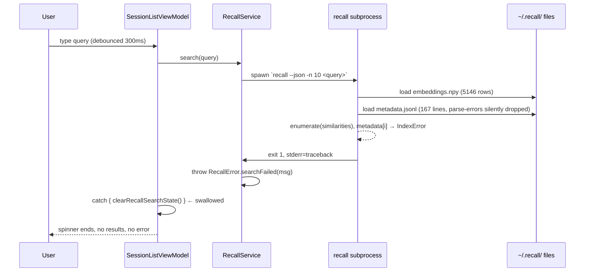
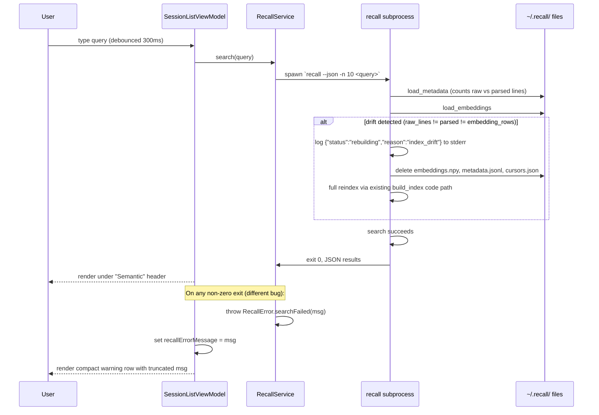

# Plan: Fix Broken Semantic Search

## Context

Semantic search in seshctl (triggered by `/` in the session list, backed by the external `recall` CLI) returns nothing for any query. Investigation revealed two compounding bugs:

1. **Root cause — `recall` index drift.** `~/.recall/embeddings.npy` has 5,146 rows but `~/.recall/metadata.jsonl` has 167 lines. `recall/search.py:62-63` iterates over `enumerate(similarities)` (length 5146) and does `metadata[i]` — crashes with `IndexError: list index out of range` on the 168th iteration. The drift happens because `recall/index.py:load_metadata()` silently `continue`s past any `json.JSONDecodeError` / `TypeError`, so corrupt or schema-evolved metadata lines vanish while their embeddings stay. Reproduces today: `recall --json -n 3 test` exits non-zero with the traceback.

2. **Seshctl swallows the error.** `SessionListViewModel.executeRecallSearch` (`Sources/SeshctlUI/SessionListViewModel.swift:1008-1011`) has a bare `catch { … clearRecallSearchState() }` that discards `RecallError.searchFailed`. The detailed message ("recall exited with status N: \<traceback>") built in `RecallService.swift:118-121` never reaches the UI. From the user's POV: spinner shows briefly, then nothing — no error row, no hint that recall is misbehaving (the "Install recall" message also doesn't fire because the binary IS installed).

The fix is in two repos:
- `/Users/julianlo/Documents/me/recall/` — auto-detect index drift on load, rebuild from scratch; also stop silently swallowing parse errors.
- `/Users/julianlo/Documents/me/seshctl/` (this worktree) — surface recall errors in the search UI.

## User Experience

1. User presses `/` to enter search. Types a query.
2. **Happy path:** results render under the "Semantic" header as today. Indistinguishable from the working pre-bug behavior.
3. **First-run-after-fix on a machine with a drifted index:** recall detects `len(embeddings) != len(metadata)` (or the raw line count disagrees with parsed metadata count), wipes both files plus `cursors.json`, and runs a full reindex. The existing "Indexing N/M entries…" progress UI in `SessionListView.swift:228-248` covers this — user sees indexing progress, then results.
4. **Failure path (recall crashes for any other reason):** a new compact row appears under the search section: a yellow warning glyph plus a single-line message like `Semantic search failed: <first line of stderr or RecallError message>`. The row sits where "Install recall for semantic search" sits today; styling matches that fallback (footnote, tertiary foreground). User now has a signal to investigate instead of empty space.
5. Error row clears the moment the user types another character (new search generation) or exits search mode.

## Architecture

### Current

### Proposed

**Data flow specifics:**
- Index lives on disk at `~/.recall/` (embeddings: `numpy.save`-format, ~7.5 MB; metadata: JSONL, ~98 KB; cursors: JSON pointer-per-adapter, ~27 KB). Read fresh per `recall` invocation — no shared in-memory cache between seshctl and recall.
- The drift check is O(1) (file lengths + line count) — adds no latency unless drift is present, in which case a rebuild already takes ~50s for ~5000 entries, gated by the existing 30s timeout in `RecallService.search` (`Sources/SeshctlCore/RecallService.swift:31`). The reused-process pattern at `RecallService.swift:76-83` already handles the "indexing didn't finish in time, kick off a follow-up search" case, so the user-visible behavior on rebuild is identical to first-ever indexing today.
- New `recallErrorMessage: String?` lives only in `SessionListViewModel` memory; cleared on `exitSearch()`, `clearSearchQuery()`, and at the start of each `executeRecallSearch` (alongside `recallResults = []`).

## Current State

**Recall (Python, in `/Users/julianlo/Documents/me/recall/`):**
- `recall/search.py:34-98` — `search()` assumes positional alignment `embeddings[i] ↔ metadata[i]`. No length assertion.
- `recall/index.py:35-48` — `load_metadata()` silently drops unparseable lines (`except (json.JSONDecodeError, TypeError): continue`). No mismatch detection vs `load_embeddings()`.
- `recall/index.py:57-121` — `build_index()` already supports `force=True` rebuild path. Auto-repair will reuse this.
- `recall/cli.py:154` — entry to `search()` from CLI. Already emits indexing-progress JSON to stderr in `--json` mode; same mechanism reused for the rebuild-reason status line.
- Tests: `/Users/julianlo/Documents/me/recall/tests/` (need to verify shape — agent didn't inventory the recall repo's tests; will check during implementation).

**Seshctl (Swift, this worktree):**
- `Sources/SeshctlCore/RecallService.swift` — `search()` throws `RecallError.searchFailed(String)` on non-zero exit (lines 117-122 and 162-168). Message already includes status + stderr/stdout.
- `Sources/SeshctlUI/SessionListViewModel.swift:975-1013` — `executeRecallSearch` has separate `catch let recallError as RecallError` (handles `.notInstalled`) and bare `catch` (silently swallows everything else).
- `Sources/SeshctlUI/SessionListView.swift:226-298` — renders the "Semantic" section. The `recallUnavailable` branch at 287-297 is the styling template to follow for the new error row.
- Published state: `recallResults`, `isRecallSearching`, `recallIndexingDone/Total`, `recallUnavailable`, `recallGeneration` at `SessionListViewModel.swift:46-51`. New `recallErrorMessage: String?` joins them.
- Tests: `Tests/SeshctlCoreTests/RecallServiceTests.swift` (covers process lifecycle / JSON decoding), `Tests/SeshctlUITests/SessionListViewModelTests.swift` (covers search state transitions). Both files exist and have the patterns to extend.

## Proposed Changes

**Recall side — drift-detection in load, rebuild on mismatch.**
- `load_metadata()` returns `(entries, raw_line_count)` so callers know if any lines were silently dropped. Existing call sites adapt.
- `build_index()` adds a pre-load consistency check: if `len(existing_emb)`, `len(existing_meta)`, and `raw_line_count` are not all equal, treat as `force=True`, emit `{"status":"rebuilding","reason":"index_drift"}` on stderr in JSON mode, and rebuild. No silent swallow.
- The rebuild path already exists; this just adds the trigger.

**Seshctl side — surface recall failures in the UI.**
- Add `@Published var recallErrorMessage: String?` to `SessionListViewModel`. Cleared at the start of `executeRecallSearch` and on `exitSearch` / `clearSearchQuery`.
- In the bare `catch` and `catch let recallError as RecallError` (non-`.notInstalled` branches), extract a one-line summary (first non-empty line of the error message, capped at ~200 chars to keep the row compact) and assign to `recallErrorMessage`.
- In `SessionListView`, add a small `if let msg = viewModel.recallErrorMessage` block in the same section, modeled on the `recallUnavailable` row but using `exclamationmark.triangle` and an orange foreground for visual distinction.

### Complexity Assessment

**Low.** Five files across two repos. No new patterns introduced — recall's `force=True` path and seshctl's `recallUnavailable` row are already established and we're just adding triggers/consumers. Risk: the drift-rebuild path runs the full reindex (~50s for this user's 5k entries) and may hit the existing 30s seshctl timeout, but the `RecallService` already handles this case by kicking off a follow-up search after the long-running indexing process completes (`RecallService.swift:124-131`). Trickiest part is keeping the error-message extraction tight enough to fit one row without losing diagnostic value — handled with a `firstLine(maxLength:)` helper.

## Impact Analysis

- **New Files**: none
- **Modified Files (recall repo, separate from this worktree):**
  - `/Users/julianlo/Documents/me/recall/recall/index.py` — drift detection + `load_metadata` returns line count
  - `/Users/julianlo/Documents/me/recall/recall/cli.py` — pass-through any new keyword args if needed (likely no change)
  - `/Users/julianlo/Documents/me/recall/tests/` — add a test for the drift-rebuild path (file TBD during implementation)
- **Modified Files (this seshctl worktree):**
  - `Sources/SeshctlUI/SessionListViewModel.swift` — `recallErrorMessage` state + populate in catch branches
  - `Sources/SeshctlUI/SessionListView.swift` — render error row in search section
  - `Tests/SeshctlUITests/SessionListViewModelTests.swift` — test the error-surfacing path
- **Dependencies**: seshctl→recall is via subprocess only. Recall changes don't require any seshctl-side schema update. The new `{"status":"rebuilding"…}` stderr line is informational — the existing `StderrBuffer` in `RecallService.swift:338-398` already ignores any JSON line that isn't `status: "indexing"`, so it's forward-compatible without change.
- **Similar Modules**: the `recallUnavailable` UI branch at `SessionListView.swift:287-297` is the explicit template; reuse styling. `RecallError` enum at `RecallService.swift:3-7` already carries the message — no new error type needed.

## Key Decisions

- **Auto-rebuild on drift instead of fail-loud**: chosen for self-healing per user's clarification answer. Trade-off: a user who hit drift will see a ~50s indexing run on their first post-fix search, but no manual intervention required. The progress UI already handles this gracefully.
- **Single error-row in seshctl rather than a modal/toast**: matches the existing `recallUnavailable` affordance and keeps search ergonomics tight (don't disrupt typing). User can read it; if they want more, the message gets logged to console via `print` (light-touch) for grep-ability.
- **No new `RecallError` case** — the existing `.searchFailed(String)` carries everything needed; the UI just needs to render it.

## Implementation Steps

### Step 1: Recall — drift detection in `load_metadata`
- [x] Modify `/Users/julianlo/Documents/me/recall/recall/index.py:35-48` so `load_metadata()` returns `tuple[list[HistoryEntry], int]` — entries plus raw non-empty line count. Update the single internal caller.

### Step 2: Recall — auto-rebuild on drift in `build_index`
- [x] In `/Users/julianlo/Documents/me/recall/recall/index.py:57-121`, after loading `existing_emb` and `existing_meta` (and the new raw line count), check three-way consistency. On mismatch: emit `{"status":"rebuilding","reason":"index_drift","embedding_rows":N,"metadata_lines":M}` to stderr (only when `json_status=True`; plain-text equivalent otherwise), reset `existing_emb=None`, `existing_meta=[]`, `cursors={}`, and fall through to the existing rebuild branch.

### Step 3: Seshctl — add `recallErrorMessage` state
- [x] Add `@Published var recallErrorMessage: String?` near the existing recall published properties in `Sources/SeshctlUI/SessionListViewModel.swift:46-51`.
- [x] In `executeRecallSearch` (line 975), set `recallErrorMessage = nil` alongside `recallResults = []` at the start.
- [x] In `exitSearch` (line 803) and `clearSearchQuery` (line 842), set `recallErrorMessage = nil`.

### Step 4: Seshctl — populate error in catch branches
- [x] In `executeRecallSearch`'s `catch let recallError as RecallError` (line 1002), populate `recallErrorMessage` with a one-line summary for `.timeout` and `.searchFailed(msg)` (leave `.notInstalled` alone — that already triggers `recallUnavailable`).
- [x] In the bare `catch` (line 1008), populate `recallErrorMessage` with `error.localizedDescription`.
- [x] Add a private `Self.firstLine(_ s: String, maxLength: Int = 200) -> String` helper for trimming.

### Step 5: Seshctl — render error row
- [x] In `Sources/SeshctlUI/SessionListView.swift`, after the existing `recallUnavailable` block at line 287-297, add an analogous `if let msg = viewModel.recallErrorMessage` block using `exclamationmark.triangle` glyph and `.orange` foreground.

### Step 6: Tests
- [x] In `/Users/julianlo/Documents/me/recall/tests/`, add a test: pre-populate `~/.recall/` (or an injected dir) with mismatched `embeddings.npy` + `metadata.jsonl`; assert that `build_index()` deletes both and rebuilds; assert the `{"status":"rebuilding",...}` stderr line is emitted in JSON mode.
- [x] In `Tests/SeshctlUITests/SessionListViewModelTests.swift`, add a test that injects a `RecallError.searchFailed("boom")` outcome and verifies `recallErrorMessage` is populated and contains "boom" (will require introducing a small seam in `executeRecallSearch` — likely a static `Self.recallSearchProvider` closure that defaults to `RecallService.search` and can be overridden in tests; if such a seam already exists in the test file, reuse it).
- [x] In `Tests/SeshctlUITests/SessionListViewModelTests.swift`, add a test that `exitSearch` clears `recallErrorMessage`.

### Step 7: Manual end-to-end verification
- [ ] Confirm the recall fix repairs the actual on-disk drift: `recall --json -n 3 test` should now exit 0 (after a one-time rebuild) and return JSON results.
- [ ] `make install` in seshctl, open Seshctl, press `/`, type a query, verify Semantic results render.
- [ ] Manually break the index again (truncate `metadata.jsonl` to 10 lines), re-search, verify the indexing-progress UI appears and results return after rebuild.
- [ ] Move `recall` out of `$PATH` temporarily, verify "Install recall" still works (no regression). Then move it back, corrupt it (make it exit 1), verify the new error row appears with the message.

## Acceptance Criteria

- [x] [test] `build_index()` detects `len(embeddings) != len(metadata)` and triggers a full rebuild (recall pytest).
- [x] [test] `SessionListViewModel.recallErrorMessage` is populated when `RecallService.search` throws `.searchFailed`.
- [x] [test] `SessionListViewModel.recallErrorMessage` is cleared by `exitSearch()` and at the start of a new `executeRecallSearch`.
- [ ] [test-manual] `recall --json -n 3 test` exits 0 on this user's current index after the fix (the original repro is resolved).
- [ ] [test-manual] When recall fails for any other reason (e.g. binary returns exit 1 with traceback), the seshctl search section shows a single-line warning row with the failure message instead of empty space.
- [ ] [test-manual] When the index is healthy, searching shows results under the "Semantic" header with no error row.

## Edge Cases

- **Cursor file out of sync with new index**: when we trigger an auto-rebuild, we also clear `cursors.json` so the rebuild re-walks every adapter's history from the start. Otherwise the rebuilt index would miss anything between the last cursor and the corruption point.
- **Multi-line error messages from recall**: only show the first non-empty line in the row (full message still in `RecallError.searchFailed` and printed to console). Keeps the UI tidy.
- **Drift discovered mid-search-while-another-process-is-indexing**: the existing reused-process pattern in `RecallService.swift:76-83` handles this — the in-flight process completes, then a follow-up search runs against the fresh index. No change needed.
- **User clears search before rebuild completes**: existing `recallSearchTask?.cancel()` in `exitSearch` already handles this; `recallErrorMessage` is also cleared so a stale message from a previous attempt doesn't linger.

## Notes for execution

This worktree is on the seshctl branch `worktree-julo+fix-semantic-search` (created from `julo/fix-semantic-search`). The recall repo at `/Users/julianlo/Documents/me/recall/` is a separate git repo — changes there will be a separate commit/PR. Don't bundle them into the seshctl commit. Confirm the recall repo's branch state before editing.

After approval, this plan should be copied to `.agents/plans/2026-05-24-<HHMM>-fix-semantic-search.md` in the seshctl worktree root (per project AGENTS.md convention) before `/implement` runs against it.
