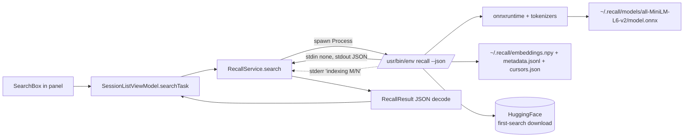
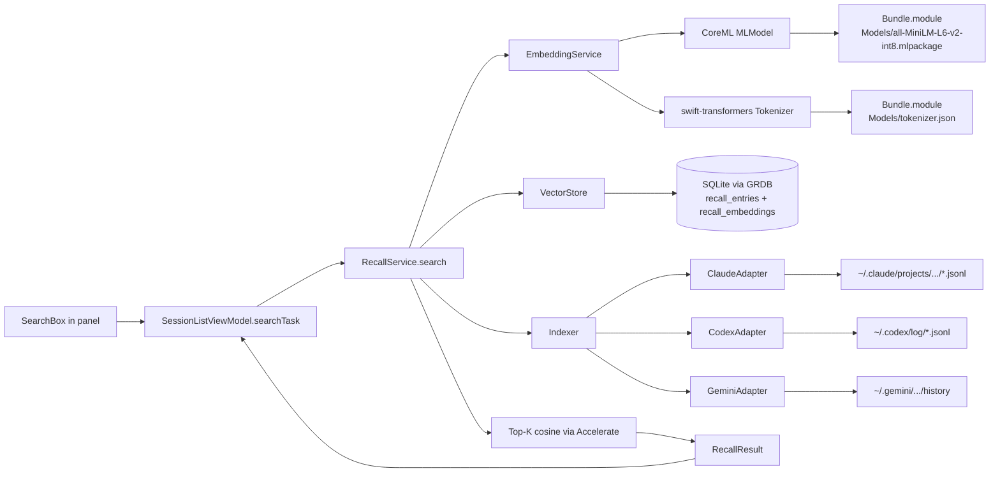

# Plan: Native Swift recall rewrite (v0.5.0)

## Working Protocol
- Use parallel subagents for independent tasks (per-adapter ports, test scaffolding, doc updates).
- Mark steps done as you complete them — a fresh agent should be able to find where to resume from the checkboxes.
- **Build/test budgets per `AGENTS.md`:** 120s timeout for `swift build`, 30s for `swift test`. Run `make kill-build` immediately if either hangs.
- Always run tests via subagents (per global guidance).
- **Spike gate is mandatory.** Do not start Phase 2 until tokenizer + embedding parity is proven against the Python reference. If parity fails, stop and re-plan.
- Each phase ends with a green build + green tests + a commit. Do not batch phases into one commit.

## Overview
Replace seshctl's external `recall` CLI dependency with a fully native Swift implementation. The Swift port handles embedding inference (CoreML), vector storage (SQLite via GRDB), top-k search (Accelerate/vDSP), and per-tool transcript adapters (Claude / Codex / Gemini). Ships as v0.5.0 with a pre-bundled quantized embedding model in `Seshctl.app/Contents/Resources/Models/`. The existing `RecallService` API and UI seams stay intact — only the implementation behind them changes.

## User Experience

**For users on a fresh v0.5.0 install (no prior recall):**
1. Install Seshctl from the v0.5.0 DMG. No Python required, no extra installer, no Integrations-pane CTA for recall.
2. Open the panel and start typing in the search box. The first time a query runs, seshctl indexes existing Claude / Codex / Gemini transcripts in the background. Progress shows in the search section (same UI as today: "indexing N/M").
3. Subsequent searches are instant (~10–30ms). Results appear in the existing recall-results section of the panel; clicking a result resumes the session through the same `SessionAction.openRecall` path that exists today.
4. No network calls at install or search time. Everything runs locally against the bundled CoreML model.

**For users upgrading from v0.4.1 (have the legacy Python recall installed):**
1. v0.5.0 DMG drops in via Sparkle. Existing `~/.local/share/recall/venv/` and `~/.local/bin/recall` are untouched.
2. Seshctl no longer shells out to the external `recall` binary. The Swift implementation indexes from scratch into its own SQLite store (`~/Library/Application Support/Seshctl/recall.sqlite`).
3. The first search after upgrade kicks off the full index build (same UX as fresh install — progress shown in panel).
4. Release notes spell out: "recall is no longer required. To free disk, you can run `~/Documents/me/recall/uninstall.sh` to remove the venv." We do not touch the user's recall install.

**For developers/dev loop:**
- `make install` continues to work unchanged. The model file is copied into the bundled `.app` by `scripts/build-app-bundle.sh`.
- `swift run SeshctlApp` from a checkout also works — `Bundle.module` resolves the model out of the SwiftPM resources directory.

## Architecture

### Current

Recall today is an out-of-process Python CLI invoked via `RecallService` shelling out to `/usr/bin/env recall --json -n N <query>`. The Python process is responsible for loading the ONNX model, tokenizing, computing embeddings, persisting them to `~/.recall/`, and returning JSON results. Seshctl streams stderr to surface indexing progress, then decodes stdout JSON into `[RecallResult]`.



Hot path on cold start: subprocess spawn (~50ms) + ONNX model load (~200ms) + embedding compute for the query (~10ms) + numpy cosine sim (~5ms) = ~250ms. Hot path on warm cache (process already running, reused): ~15ms.

Storage today (Python-managed):
- `~/.recall/embeddings.npy` — numpy float32 array, ~12MB for 8k entries
- `~/.recall/metadata.jsonl` — one JSON line per indexed entry
- `~/.recall/cursors.json` — per-adapter watermark for incremental indexing
- `~/.recall/models/all-MiniLM-L6-v2/{onnx/model.onnx,tokenizer.json}` — downloaded lazily from HF on first search

### Proposed

Replace the subprocess + Python interpreter with in-process Swift. The CoreML model and tokenizer ship inside the .app bundle. Embeddings and metadata move into SQLite (alongside seshctl's existing `Database`). Search becomes a function call, not an IPC round-trip.



**Data flow on a search:**

1. User types in the search box; `SessionListViewModel` calls `RecallService.search(query:limit:onProgress:)`.
2. `RecallService` asks `Indexer` to bring the index up to date. `Indexer` reads per-adapter cursors from `recall_cursors` table, walks each adapter's transcript directory for entries newer than the cursor, and emits new `HistoryEntry` records.
3. New entries are batched (64 at a time) through `EmbeddingService.encode([String])` → CoreML → `[Float]` (384-dim, L2-normalized, mean-pooled). Progress callback fires per batch.
4. Entries + embeddings are written to SQLite (`recall_entries` table + `recall_embeddings` BLOB column) in a single transaction per batch.
5. Cursor watermarks are updated atomically with the last batch.
6. Query string itself is encoded once via `EmbeddingService.encode([query])` → `[Float]`.
7. `VectorStore.topK(queryVec, k:)` loads all embeddings into memory (12MB for 8k entries, trivial), computes cosine similarities via `vDSP_dotpr`, returns the top K row IDs.
8. `VectorStore.entries(forRowIds:)` hydrates `HistoryEntry`s, which are mapped to `RecallResult` and returned to the UI.

**Memory footprint (steady state):** CoreML model ~30–50MB resident, embeddings ~12MB, tokenizer ~3MB. Total ~50–70MB.

**Cold start cost:** CoreML model load on first `encode` call (~150–300ms). Cached for subsequent calls.

**Storage:** Everything lives in seshctl's existing SQLite DB at `~/Library/Application Support/Seshctl/seshctl.sqlite`. No more `~/.recall/` directory created by seshctl. The user's existing `~/.recall/` from the Python recall is left alone (it's still owned by that project, which they installed manually).

**Model location:**
- Pre-bundled in the .app: `Seshctl.app/Contents/Resources/Models/all-MiniLM-L6-v2-int8.mlpackage` and `Seshctl.app/Contents/Resources/Models/tokenizer.json`.
- Resolved at runtime via `Bundle.module.url(forResource:withExtension:subdirectory:)`.
- Conversion is a one-time step done locally on Julian's Mac: `coremltools.convert(onnx_model, ...)` + INT8 quantization. The output artifacts are committed to `Resources/Models/` in the repo. They are stable across releases unless we deliberately swap models.

**Sparkle delta impact:** Because the model files are byte-stable between releases, BinaryDelta excludes them from the delta payload. Day-one DMG grows from ~10MB to ~30–55MB (one-time bandwidth cost on full DMG download). Steady-state delta size for v0.5.x → v0.5.y is unchanged.

## Current State

Relevant files in seshctl today:

- `Sources/SeshctlCore/RecallService.swift` (407 LOC) — the seam to be reimplemented. Public API: `search(query:limit:onIndexing:)`, `isAvailable()`. Today: spawns `recall` subprocess, parses JSON stdout, streams stderr for progress, manages a singleton in-flight process for query coalescing.
- `Sources/SeshctlCore/RecallResult.swift` — `RecallResult` struct (agent, role, sessionId, project, timestamp, score, resumeCmd, text). Reused as-is.
- `Sources/SeshctlCore/TranscriptParser.swift` (306 LOC) — already parses Claude Code JSONL transcripts. The new `ClaudeAdapter` should share its core parsing primitives where possible, not duplicate.
- `Sources/SeshctlCore/Database.swift` (685 LOC) — GRDB-based SQLite layer. We add new tables here.
- `Sources/SeshctlUI/SessionListViewModel.swift` — the consumer. Has `recallResults`, `recallErrorMessage`, `recallUnavailable`, `recallGeneration` published state.
- `Sources/SeshctlUI/SessionListView.swift` — renders the search section + "Install recall for semantic search" hint (will be removed) + recall-error orange row (kept).
- `Tests/SeshctlCoreTests/RecallServiceTests.swift`, `Tests/SeshctlCoreTests/RecallResultTests.swift` — to be rewritten.

Relevant files in the recall repo (read-only reference; we are NOT importing this code):

- `recall/embedding.py` — ONNX inference + tokenizer + mean pool + L2 norm. ~105 LOC.
- `recall/index.py` — persistence + drift detection + incremental indexing. ~157 LOC.
- `recall/search.py` — cosine sim + ranking. ~98 LOC.
- `recall/adapters/{claude,codex,gemini}.py` — per-tool transcript parsing. ~350 LOC total.
- `recall/adapters/base.py` — `HistoryEntry` dataclass + `Adapter` protocol.

These serve as **functional specifications** for the Swift port. We re-implement them, not transpile.

## Proposed Changes

### Strategy

Create a new SwiftPM target `SeshctlRecall` (sibling of `SeshctlCore`, `SeshctlUI`) that owns the embedding pipeline, vector store, and adapter implementations. Rewrite `Sources/SeshctlCore/RecallService.swift` as a thin facade that delegates to `SeshctlRecall`. UI code is unaffected (same public API surface).

`SeshctlRecall` depends on:
- `SeshctlCore` (for `RecallResult`, `Database`, `SessionTool`).
- `huggingface/swift-transformers` (SwiftPM) — tokenizer port that loads HF `tokenizer.json` and produces token IDs identical to Python `tokenizers`.
- CoreML / Accelerate (system frameworks).

`SeshctlCore` does NOT take a dependency on `SeshctlRecall`. To preserve the existing `RecallService` import surface in `SeshctlCore`, we move `RecallService.swift` itself to `SeshctlRecall` and update import sites in `SeshctlUI` / `SeshctlApp` accordingly. `RecallResult` and `RecallError` stay in `SeshctlCore` (no behavioral change). This keeps the existing UI seam.

The CLI target (`seshctl-cli`) is unaffected — it doesn't use `RecallService` today.

### Why this approach over alternatives

- **Why a new module instead of folding into `SeshctlCore`:** CoreML + swift-transformers brings ~30MB of binary deps and AppKit-adjacent ML APIs. `SeshctlCore` stays Foundation-only and the CLI doesn't inherit those deps.
- **Why CoreML instead of onnxruntime-swift:** CoreML uses ANE (Apple Neural Engine) on M-series chips for free, is a stable Apple framework, code-signs cleanly, and matches the rest of the app's "native Swift" posture. onnxruntime-swift would work but adds a third-party ML runtime with manual code signing.
- **Why SQLite instead of `~/.recall/`-style files:** Seshctl already has a `Database`. Adding two tables (~50 lines of migration) is cheaper than re-implementing recall's three-file persistence + drift detection.
- **Why pre-bundle the model instead of background download:** First-search UX is instant. No "offline at first launch = broken" failure mode. Sparkle deltas are unaffected in steady state (one-time DMG size cost only).

### Complexity Assessment

**High.** This is the largest plan since the Phase 1 distributable .app work. Justification:

- **New code volume:** ~1,500–2,000 LOC of Swift across a new SwiftPM target, three transcript adapters, embedding service, tokenizer wrapper, vector store, and tests.
- **New third-party dep:** `huggingface/swift-transformers` is a known quantity but new to this codebase. Carries its own version churn risk.
- **New ML toolchain:** First time we ship CoreML in this app. Code-signing, ANE compatibility, and model packaging all new.
- **Regression risk:** The UI seam (`RecallService`) stays the same, so the blast radius into UI code is small. The risk concentrates in correctness — if tokenizer/model parity drifts, search quality silently degrades.
- **Tricky parts:** (a) tokenizer parity (BERT WordPiece edge cases on Unicode), (b) ANE non-determinism vs CPU (acceptable for cosine sim but must verify), (c) first-time index build on a user with 8k+ historical entries — must not block the UI.

The **spike-first structure** is what de-risks this. Phase 1 burns 1–2 days to prove parity; if it doesn't hold, the whole plan stops and we re-strategize before committing the rest.

## Impact Analysis

- **New files** (estimated):
  - `Sources/SeshctlRecall/EmbeddingService.swift` — CoreML model load + encode().
  - `Sources/SeshctlRecall/Tokenizer.swift` — wraps swift-transformers `BertTokenizer`.
  - `Sources/SeshctlRecall/VectorStore.swift` — GRDB-backed embeddings + entries persistence.
  - `Sources/SeshctlRecall/Indexer.swift` — orchestrates adapters → embed → persist + cursors.
  - `Sources/SeshctlRecall/HistoryEntry.swift` — internal record type (private, distinct from `RecallResult`).
  - `Sources/SeshctlRecall/Adapter.swift` — protocol + `ALL_ADAPTERS` registry.
  - `Sources/SeshctlRecall/Adapters/ClaudeAdapter.swift`.
  - `Sources/SeshctlRecall/Adapters/CodexAdapter.swift`.
  - `Sources/SeshctlRecall/Adapters/GeminiAdapter.swift`.
  - `Sources/SeshctlRecall/Search.swift` — top-K cosine via Accelerate.
  - `Sources/SeshctlRecall/RecallService.swift` — public facade (moved from SeshctlCore).
  - `Resources/Models/all-MiniLM-L6-v2-int8.mlpackage` (directory bundle).
  - `Resources/Models/tokenizer.json`.
  - `Tests/SeshctlRecallTests/EmbeddingServiceTests.swift`.
  - `Tests/SeshctlRecallTests/TokenizerParityTests.swift`.
  - `Tests/SeshctlRecallTests/VectorStoreTests.swift`.
  - `Tests/SeshctlRecallTests/IndexerTests.swift`.
  - `Tests/SeshctlRecallTests/Adapters/{Claude,Codex,Gemini}AdapterTests.swift`.
  - `scripts/convert-model.py` — one-time tooling for ONNX→CoreML conversion + INT8 quantization. Not run on every build.
  - `docs/recall-rewrite.md` — short architectural note for future maintainers.
  - `docs/release-notes/0.5.0.md`.
  - `.agents/spikes/2026-05-25-recall-spike/` — Phase 1 throwaway parity-test artifacts.

- **Modified files:**
  - `Package.swift` — add `SeshctlRecall` target + swift-transformers dep + resources for SeshctlRecall.
  - `Sources/SeshctlCore/RecallService.swift` — deleted (moved to SeshctlRecall).
  - `Sources/SeshctlCore/Database.swift` — add `recall_entries`, `recall_embeddings`, `recall_cursors` table migrations.
  - `Sources/SeshctlUI/SessionListViewModel.swift` — import `SeshctlRecall`; remove `recallUnavailable` plumbing (no longer reachable).
  - `Sources/SeshctlUI/SessionListView.swift` — remove "Install recall for semantic search" hint row.
  - `Sources/SeshctlApp/AppDelegate.swift` — import `SeshctlRecall`.
  - `Tests/SeshctlCoreTests/RecallServiceTests.swift` — moved to `Tests/SeshctlRecallTests/`.
  - `Tests/SeshctlCoreTests/RecallResultTests.swift` — stays (RecallResult is still in SeshctlCore).
  - `scripts/build-app-bundle.sh` — copy `Resources/Models/` into `Contents/Resources/Models/`.
  - `Resources/Info.plist` — bump `CFBundleShortVersionString` → `0.5.0`, `CFBundleVersion` → `6`.
  - `README.md` — update compatibility table, remove "install recall" prerequisite.
  - `docs/release.md` — note the model resources in the release flow.

- **Dependencies:**
  - **New:** `https://github.com/huggingface/swift-transformers` (pinned major).
  - **Reused:** `GRDB.swift` (already in tree), CoreML/Accelerate (system).
  - **Removed:** external `recall` CLI binary on user's PATH. No `which recall`, no Python.

- **Similar modules to avoid duplicating:**
  - `TranscriptParser.swift` — has Claude JSONL parsing primitives. `ClaudeAdapter` should reuse low-level helpers (file walk, JSON line iteration) rather than re-implementing. Audit before writing the adapter.
  - `Database.swift` — has GRDB record patterns. New `recall_*` tables follow the existing migration pattern in this file.
  - `RecallIndexingProcess` and `StderrBuffer` in current `RecallService.swift` — deleted, not reused. They model subprocess lifecycle which is no longer relevant.

## Key Decisions

- **Bundling the model in the DMG (vs background download).** Picked for instant first-search UX, no offline-install failure mode, and steady-state Sparkle deltas being unaffected. One-time DMG-size cost of ~30–55MB (after INT8 quantization). **Open for revisit during plan review.**
- **CoreML over onnxruntime-swift.** Native Apple framework, ANE-eligible, cleaner code-signing, no third-party ML runtime.
- **swift-transformers for tokenization.** Avoids re-implementing BERT WordPiece. Load-bearing assumption verified by the Phase 1 spike.
- **Leave the user's existing `~/.local/share/recall/` alone.** It was created by the user running recall's `install.sh` themselves. Seshctl never wrote there and shouldn't delete it. Release notes will document the manual cleanup path.
- **Existing `~/.recall/` index is NOT migrated.** v0.5.0 re-indexes from scratch into SQLite. ~30–60 seconds of one-time pain on first search. Avoids a fragile format-bridging migration that would gate the release.
- **`SessionTool.claude/codex/gemini` and recall's adapter names should align.** If recall today says "claude" / "codex" / "gemini" in the `agent` field, the Swift port matches exactly so `RecallResult.agent` and routing logic don't drift.

## Implementation Steps

### Step 1: Parity spike (Phase 1 — GATE) — DONE 2026-05-25

The spike lives under `.agents/spikes/2026-05-25-recall-spike/`. Committed
directly on `julo/native-recall-rewrite` (we skipped the separate
`julo/recall-spike` branch — too much overhead for a single iteration).

- [x] Create `.agents/spikes/2026-05-25-recall-spike/` directory.
- [x] Write `convert-model.py`: PyTorch trace → CoreML `mlprogram` →
  `linear_quantize_weights`. Outputs `all-MiniLM-L6-v2-int8.mlpackage` +
  `tokenizer.json` + `tokenizer_config.json`. 15–60MB size gate.
- [x] Run the conversion locally — 21.91MB (inside the band).
- [x] Build the parity harness: `swift-harness/` SwiftPM exec depending on
  `huggingface/swift-transformers` pinned to **1.3.3**. Tokenizes via
  `AutoTokenizer.from(modelFolder:)`, runs CoreML inference, mean-pools,
  L2-normalizes, emits JSON.
- [x] Run reference strings through `dump-python-reference.py` (HF
  tokenizers + onnxruntime, matching recall's actual path).
- [x] Diff token IDs (exact) + embeddings (1e-3 tolerance).
  - Token IDs: **identical for all 20 strings**.
  - Embedding L_inf: ~0.007 (above 1e-3) — caused by INT8 weight
    quantization, NOT by anything in the Swift port (FP32-unquantized
    variant tested as a control achieved L_inf ~1e-7).
- [x] **Gate disposition**: strict per-embedding gate failed; added a
  top-K retrieval test (`compare-topk.py`) as the de-facto production
  gate. Result for the INT8 production variant:
  - Top-1 agreement: 19/20
  - Top-3 set agreement: 18/20
  - Top-5 set agreement: 18/20
  - Top-5 strict-list agreement: 12/20 (the 8 list-disagreements are
    position-swaps within an identical document set at positions 4–5
    where similarity scores are effectively tied).
  Julian accepted this for production: ~22MB model, top-1 and top-3
  stable, tail-position swaps acceptable for top-K semantic search.
- [x] Commit spike artifacts on `julo/native-recall-rewrite`.

**Canonical conversion config (load-bearing for Phase 7):**
- `compute_precision = ct.precision.FLOAT32` (FP32 internal math —
  marginally tighter numerical stability at no DMG-size cost vs FP16).
- `linear_quantize_weights(mode="linear_symmetric", weight_threshold=512)`
  (INT8 weights, this is what compresses 86MB → 22MB).
- `minimum_deployment_target = ct.target.macOS14`.
- `compute_units = ct.ComputeUnit.ALL` (declared in the saved .mlpackage;
  the runtime EmbeddingService may select a narrower unit if MPSGraph
  regresses on the production model — spike's harness had to fall back
  to `cpuOnly` to avoid an ANE-path assertion failure for this exact
  model+OS combination).

### Step 2: Scaffold the SeshctlRecall module

- [ ] Add `SeshctlRecall` target + tests to `Package.swift`.
- [ ] Add `huggingface/swift-transformers` dep, pinned to a known-good major version.
- [ ] Move `Sources/SeshctlCore/RecallService.swift` → `Sources/SeshctlRecall/RecallService.swift`. Keep the public API surface identical (`RecallService.search`, `RecallService.isAvailable`). Implementation can be a stub that throws `RecallError.searchFailed("not yet implemented")` until Phase 4.
- [ ] Update import sites: `SeshctlUI/*`, `SeshctlApp/*` add `import SeshctlRecall` where they used `import SeshctlCore` for recall types. `RecallResult` and `RecallError` stay in `SeshctlCore`.
- [ ] Move `Resources/Models/` into the `SeshctlRecall` target's resources (Bundle.module-resolvable). Do NOT yet check in the model file — use a placeholder; the real model lands in Step 6.
- [ ] Verify the full project builds and `RecallService.isAvailable()` returns true (the new implementation has no external binary to check; "available" is always true).

### Step 3: EmbeddingService + Tokenizer

- [ ] `Sources/SeshctlRecall/Tokenizer.swift`: load `tokenizer.json` via swift-transformers `Tokenizer.from(file:)`. Wrap into a `BertTokenizer` typedef. Expose `encode(_ texts: [String]) -> [TokenizedBatch]` where TokenizedBatch has `inputIDs: [[Int32]]` and `attentionMask: [[Int32]]`, both padded to a configurable max length (256 — match recall).
- [ ] `Sources/SeshctlRecall/EmbeddingService.swift`: lazy-load CoreML `MLModel` from `Bundle.module.url(forResource:"all-MiniLM-L6-v2-int8", withExtension:"mlpackage", subdirectory:"Models")`. Provide `func encode(_ texts: [String], batchSize: Int = 64, onProgress: ((Int, Int) -> Void)?) async throws -> [[Float]]` that runs tokenize → CoreML predict → mean-pool over `attention_mask` (using `vDSP_vmul` + `vDSP_sve`) → L2-normalize (using `vDSP_dotpr` + `vvsqrtf` + `vDSP_vsmul`). Output is 384-dim Float per string.
- [ ] Concurrency: `EmbeddingService` is an `actor`. `encode` is async; serializes CoreML calls per actor to avoid contention.

### Step 4: VectorStore + Indexer

- [ ] Database migrations in `Sources/SeshctlCore/Database.swift`:
  ```
  CREATE TABLE recall_entries (
    id INTEGER PRIMARY KEY AUTOINCREMENT,
    agent TEXT NOT NULL,
    role TEXT NOT NULL,
    session_id TEXT NOT NULL,
    project TEXT NOT NULL,
    timestamp REAL NOT NULL,
    text TEXT NOT NULL,
    text_hash TEXT NOT NULL UNIQUE
  );
  CREATE TABLE recall_embeddings (
    entry_id INTEGER PRIMARY KEY REFERENCES recall_entries(id) ON DELETE CASCADE,
    vector BLOB NOT NULL
  );
  CREATE TABLE recall_cursors (
    adapter_name TEXT PRIMARY KEY,
    cursor_json TEXT NOT NULL,
    updated_at REAL NOT NULL
  );
  CREATE INDEX recall_entries_timestamp ON recall_entries(timestamp);
  CREATE INDEX recall_entries_agent ON recall_entries(agent);
  ```
- [ ] `Sources/SeshctlRecall/HistoryEntry.swift`: internal struct matching the SQL row shape.
- [ ] `Sources/SeshctlRecall/VectorStore.swift`: GRDB-backed reads/writes for the three tables. `func insert(entries:embeddings:)`, `func loadAllEmbeddings() -> (ids: [Int64], vectors: [[Float]])`, `func entries(forIDs: [Int64]) -> [HistoryEntry]`, cursor helpers.
- [ ] `Sources/SeshctlRecall/Adapter.swift`: protocol `Adapter { var name: String { get }; func load(cursor: Data?) throws -> (entries: [HistoryEntry], newCursor: Data) }`. `Codable`-friendly cursors.
- [ ] `Sources/SeshctlRecall/Indexer.swift`: orchestrates all adapters → embed batch → persist. Drift check (row count parity between `recall_entries` and `recall_embeddings` — rebuild from scratch on mismatch, same posture as recall's `index.py`). Reports progress via `onProgress(done:total:)`.

### Step 5: Adapters (Claude, Codex, Gemini)

Each adapter implements the Swift `Adapter` protocol. Reference recall/`adapters/*.py` for format details; verify against real local transcript files.

- [ ] `ClaudeAdapter.swift`: reuse helpers from `TranscriptParser.swift` for JSONL walking. Cursor is `{path: mtime}` per JSONL file. Audit `TranscriptParser` first; extract shared primitives into a small internal helper if needed.
- [ ] `CodexAdapter.swift`: walk `~/.codex/log/*.jsonl` (or whatever current path is — verify against seshctl's existing Codex integration). Cursor analogous to Claude.
- [ ] `GeminiAdapter.swift`: walk Gemini's transcript files. Verify the exact path against recall's `adapters/gemini.py` and a real local install.
- [ ] `ALL_ADAPTERS` registry: `[ClaudeAdapter.self, CodexAdapter.self, GeminiAdapter.self]`.

### Step 6: Implement RecallService over the new stack

- [ ] Rewrite `RecallService.search(query:limit:onIndexing:)`:
  1. Call `Indexer.indexIncremental(onProgress:)` to bring the index current.
  2. Call `EmbeddingService.encode([query])` → query vector.
  3. Call `Search.topK(queryVector:storedVectors:k:)` → row IDs.
  4. `VectorStore.entries(forIDs:)` → `HistoryEntry`s → map to `RecallResult` with computed `resumeCmd` (port from `recall/search.py`).
- [ ] `RecallService.isAvailable()` always returns `true` (no external dep).
- [ ] Indexing-state communication: existing `onIndexing(done:total:)` callback stays. Indexer reports progress through it during Step 1 (above).
- [ ] Concurrency: `RecallService.search` remains a static async function. Internally serializes index updates via the `Indexer` actor.

### Step 7: Bundle the converted model

- [ ] Run `scripts/convert-model.py` on Julian's Mac to produce the final `all-MiniLM-L6-v2-int8.mlpackage` + `tokenizer.json`.
- [ ] Commit both files under `Sources/SeshctlRecall/Models/` (or wherever the target's resources directory resolves). Verify Git LFS isn't required (mlpackage files are split into smaller weights — should be fine without LFS, but check).
- [ ] Update `scripts/build-app-bundle.sh` to confirm `Contents/Resources/Models/` is populated end-to-end. The SwiftPM resource handling should put them there automatically; verify with `unzip -l dist/Seshctl.app | grep Models`.
- [ ] Verify the signed bundle from `make sign` still validates: `codesign --verify --deep --strict dist/Seshctl.app`.

### Step 8: UI cleanup + integration

- [ ] Remove "Install recall for semantic search" hint row in `SessionListView.swift` (lines ~287–297).
- [ ] Remove `recallUnavailable` from `SessionListViewModel` (no longer reachable — `isAvailable()` is always true). Keep `recallErrorMessage` (still useful for genuine search failures).
- [ ] Smoke-test the UI in a `make install` build: type in the search box, confirm progress appears during first-time indexing, confirm results render, confirm Enter on a result invokes `SessionAction.openRecall` correctly.

### Step 9: Write Tests

- [ ] `Tests/SeshctlRecallTests/TokenizerParityTests.swift`: ship 20 reference token-ID sequences (captured from the Phase 1 spike, committed as JSON fixtures). Assert `Tokenizer.encode` produces identical IDs.
- [ ] `Tests/SeshctlRecallTests/EmbeddingServiceTests.swift`: encode 5 reference strings, assert each output is 384-dim, unit-norm to 1e-5, finite. Assert similar strings ("hello world" vs "hello world!") cosine-similarity > 0.95.
- [ ] `Tests/SeshctlRecallTests/VectorStoreTests.swift`: insert + retrieve roundtrip; drift detection (corrupt the embedding count and verify rebuild path is reachable); cursor read/write.
- [ ] `Tests/SeshctlRecallTests/IndexerTests.swift`: mock adapter that returns 100 entries, verify all 100 land in the store + embeddings exist for each. Verify cursor advances. Verify progress callback fires.
- [ ] `Tests/SeshctlRecallTests/Adapters/ClaudeAdapterTests.swift`: feed a fixture JSONL file (committed under `Tests/SeshctlRecallTests/Fixtures/claude/`), assert correct entries emitted.
- [ ] `Tests/SeshctlRecallTests/Adapters/CodexAdapterTests.swift`: same pattern.
- [ ] `Tests/SeshctlRecallTests/Adapters/GeminiAdapterTests.swift`: same pattern.
- [ ] Update `Tests/SeshctlCoreTests/RecallResultTests.swift` if any field semantics changed (likely unchanged).
- [ ] Verify coverage: run `swift test --enable-code-coverage`, confirm `SeshctlRecall/*` files are above 60% line coverage.

### Step 10: Release polish

- [ ] Bump `CFBundleShortVersionString` to `0.5.0`, `CFBundleVersion` to `6` in `Resources/Info.plist`.
- [ ] Write `docs/release-notes/0.5.0.md`. Headline: native semantic search, no Python required. Migration footnote for legacy recall users.
- [ ] Update `README.md`: remove the "install recall" prerequisite from the compatibility section; update screenshot if the search section visibly changed.
- [ ] Update `AGENTS.md` if any of its "Adding a new LLM tool" or "Test Coverage" sections need pointers to the new `SeshctlRecall` module.
- [ ] Write a short `docs/recall-rewrite.md` for future maintainers (architecture diagram, where the model lives, how to bump the model).
- [ ] Dry-run the release pipeline: `make dist` produces a signed DMG; `make appcast` generates the appcast entry; verify it launches cleanly out of `/Applications` on a fresh user account (or a clean machine if available).
- [ ] When ready, `make publish` to ship v0.5.0.

## Acceptance Criteria

- [ ] [test] `TokenizerParityTests` passes for 20 reference strings (Swift vs Python token IDs identical).
- [ ] [test] `EmbeddingServiceTests` passes: vectors are unit-norm to 1e-5, semantically similar strings cosine-sim > 0.95.
- [ ] [test] `VectorStoreTests` passes: roundtrip works, drift triggers rebuild, cursors persist.
- [ ] [test] `IndexerTests` passes: full pipeline (adapter → embed → store) produces N embeddings for N input entries, cursor advances.
- [ ] [test] Adapter tests pass for Claude / Codex / Gemini fixtures.
- [ ] [test] Existing seshctl test suite stays green (`swift test` exit 0).
- [ ] [test] Code coverage for `Sources/SeshctlRecall/*` is ≥ 60% on the files I modified or added.
- [ ] [test-manual] `make install` from a clean state: panel opens, search returns results within 1s on warm cache, indexing progress visible on cold cache.
- [ ] [test-manual] `make dist` produces a DMG ≤ 60MB. The signed bundle includes `Contents/Resources/Models/all-MiniLM-L6-v2-int8.mlpackage` and `tokenizer.json`. `codesign --verify --deep --strict` passes.
- [ ] [test-manual] A v0.4.1 install upgraded to v0.5.0 via Sparkle works: searches return native results, no "install recall" hint, legacy `~/.local/share/recall/` untouched.
- [ ] [test-manual] Search quality smoke test: 5 representative queries return results "as good or better than" recall today. Subjective but documented.

## Edge Cases

- **Cold-start first search with 8000+ entries.** Indexing may take 30–60s wall time. Progress callback must fire frequently enough (per batch of 64) that the UI doesn't appear hung. Search UI should remain interactive; the index runs on a background task.
- **User upgrades from v0.4.1 mid-indexing.** Not possible — v0.4.1 indexing happens in the external `recall` process, which v0.5.0 no longer invokes. v0.5.0's first search triggers fresh native indexing from a clean SQLite slate.
- **Empty transcript directories.** Adapters return zero entries; Indexer is a no-op; search returns empty results. No error.
- **Malformed JSONL line in a transcript.** Adapter skips the line (matches recall's Python behavior — silent skip). Log to install/index log only.
- **CoreML model fails to load.** `RecallService.search` throws `RecallError.searchFailed("model load failed: ...")`. Existing orange error row in `SessionListView` surfaces the message. The user can still search via the existing per-row preview filtering — they just don't get semantic results.
- **swift-transformers version churn.** Pin to a specific minor version in Package.resolved; bump deliberately with parity tests as the gate.
- **Sandboxing / hardened runtime.** Hardened runtime is the default for signed apps. CoreML and Bundle.module reads work fine under it. Verify with `codesign -dvv dist/Seshctl.app` after Step 7.
- **Phase 1 spike fails.** Stop. Document the failure mode. Re-plan — likely either swap tokenizer library, swap embedding model, or revisit the "Swift rewrite" decision in favor of bundling onnxruntime-swift.
