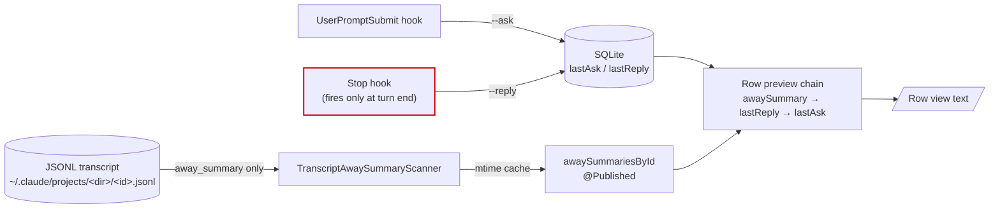
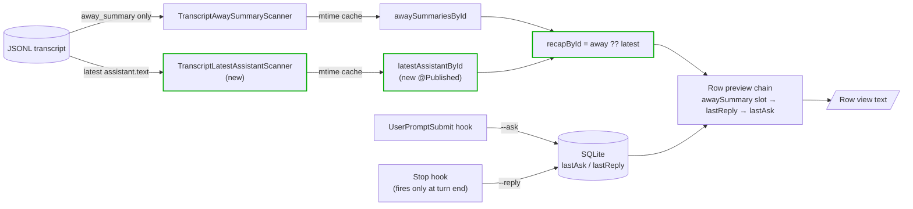

# Plan: Live assistant text as row recap for local Claude sessions

## Working Protocol
- Use parallel subagents for independent tasks (reading, searching, implementing across files).
- Mark steps done as you complete them — a fresh agent should be able to find where to resume.
- Run `swift test` (30s timeout) after each step before moving on. If a build hangs, run `make kill-build` first.
- Keep `make install` available as the manual smoke path; the assistant doesn't need to run it.

## Overview
Add a transcript-derived scanner that surfaces the latest assistant text from a local Claude Code JSONL transcript as the row recap, so rows update during long mid-response stretches instead of staying stuck on the user's last prompt (e.g. "You: continue") until the `Stop` hook fires. Mirrors the local-side equivalent of PR #45's remote-side `RemoteEventsParser` + `remoteAwaySummariesById`.

## User Experience

**Today.** A user sends "continue". The row updates to `You: continue` and stays there for the entire duration of the assistant's response — often 3+ minutes for a long multi-tool-call turn. The detail view shows the assistant's content streaming in (it reads the transcript live), but the panel row gives no signal that anything has changed. The recap only updates when the `Stop` hook fires after the assistant finishes the whole turn.

**After.** Within ~2 seconds of the assistant's first streamed text block landing in the JSONL, the row recap switches from `You: <prompt>` to a trimmed multi-line snippet of that text. The recap continues to update as the assistant streams more text (each scan picks the latest assistant turn). When the user queues a follow-up prompt before the assistant has produced any new text, the row falls back to `You: <new prompt>` — the "current state" framing wins, matching how `away_summary` is already invalidated.

Edge: while the assistant is in a tool-only loop (no text content blocks emitted yet on the current turn), the row temporarily shows `You: <prompt>` instead of stale text from a previous turn. The moment any text block streams in, the recap takes over.

## Architecture

### Current

Local Claude row recap is sourced from DB fields populated only by hooks:
- `UserPromptSubmit` hook → `seshctl-cli update --ask "<prompt>"` → `Session.lastAsk` set immediately.
- `Stop` hook → `seshctl-cli update --reply "<last_assistant_message>"` → `Session.lastReply` set only when the whole turn terminates.
- `TranscriptAwaySummaryScanner` reads `system/away_summary` events from the JSONL (Claude emits these only after long autonomous stretches), cached + published as `awaySummariesById`.

Display chain (`Session+Display.swift:288` `previewContent(awaySummary:)`):
`awaySummary` → `lastReply` → `lastAsk` → status hint.



The wedge: during a long response, `Stop` hasn't fired so `lastReply` is empty; `away_summary` isn't emitted on normal turns; the chain falls through to `lastAsk`.

### Proposed

Add a sibling scanner `TranscriptLatestAssistantScanner` that walks the JSONL for the most recent `assistant` event's first `text` content block. The view model caches it by mtime (mirroring `transcriptAwaySummaryCache`) and publishes a `latestAssistantById` map. At the moment `awaySummariesById` is consumed in the row, **the view model collapses the two into a single optional** — `awaySummary ?? latestAssistant` — and passes it through the unchanged `previewContent(awaySummary:)` slot.



**Runtime walkthrough.** On each ~2s `SessionListViewModel.refresh()` tick:
1. For each local Claude session with a `transcriptPath`, look up `(path, mtime)` in `transcriptLatestAssistantCache`. If the cached mtime matches, reuse the cached value (no disk read).
2. On a mtime miss, call `TranscriptLatestAssistantScanner.extractLatestAssistantText(transcriptPath:)`. The scanner reads the file (one `String(contentsOfFile:)`), walks it line-by-line via `enumerateLines`, tracks the latest `assistant` event's first `text` block, and **clears its tracking when a `user` event lands after the latest assistant turn** (so a pending user prompt returns nil and the row falls through to `lastAsk`). If the latest assistant turn is purely `thinking` / `tool_use` (no `text` block), return nil — do not walk back to older turns.
3. Update `latestAssistantCacheEntry` for this path, write into the published `latestAssistantById` map keyed by `session.id`.
4. Prune cache entries whose path is no longer in `livePaths` (mirrors `pruneTranscriptAwaySummaryCache`).
5. The two consumer sites (`SessionListView`, `SessionTreeView`) read `viewModel.awaySummariesById[id] ?? viewModel.latestAssistantById[id]` and hand the combined optional to `session.previewContent(awaySummary:)`. **No new slot, no display-chain change.**

State persistence: nothing on disk — both caches live in-memory on the `SessionListViewModel`. Scanner I/O is one full-file read per mtime-changed transcript per refresh tick. For a long-running session with a multi-MB JSONL, that's ~ms on local SSD; the `transcriptAwaySummaryCache` pattern is the same and has been in production since PR #43.

## Current State

Files that already implement the pattern this plan mirrors:
- `Sources/SeshctlCore/TranscriptAwaySummaryScanner.swift` — pure-Foundation scanner, public enum + static method, returns `String?`.
- `Sources/SeshctlCore/RemoteEventsParser.swift` — remote-side analog, documents the tool-use-only → nil rule.
- `Sources/SeshctlUI/SessionListViewModel.swift:728` — `cachedAwaySummary(for:)` (Claude-only guard + mtime cache + cache write).
- `Sources/SeshctlUI/SessionListViewModel.swift:744` — `pruneTranscriptAwaySummaryCache(keepingPaths:)`.
- `Sources/SeshctlUI/SessionListViewModel.swift:36` — `@Published var awaySummariesById` declaration + doc-comment template.
- `Sources/SeshctlUI/SessionListViewModel.swift:235-243` — refresh() loop that builds the per-session map and prunes.
- `Sources/SeshctlUI/Session+Display.swift:288` — `previewContent(awaySummary:)` consumer — **unchanged**.
- `Sources/SeshctlUI/SessionListView.swift` and `SessionTreeView.swift` — row construction sites that thread `awaySummary` into the row view.
- `Tests/SeshctlCoreTests/TranscriptAwaySummaryScannerTests.swift` — scanner-side test template.
- `Tests/SeshctlCoreTests/RemoteEventsParserTests.swift` — content-block walking test template (tool-use-only-returns-nil, walksPastThinking shapes already covered).

Claude Code JSONL transcript shape (verified against `~/.claude/projects/.../*.jsonl`):
```json
{"type":"assistant","message":{"role":"assistant","content":[
  {"type":"thinking","thinking":"...","signature":"..."},
  {"type":"text","text":"..."},
  {"type":"tool_use","name":"Read","input":{...}}
]},"timestamp":"...","sessionId":"..."}
```

User turns: `{"type":"user","message":{"role":"user","content":...}}` (content can be array of blocks or a plain string — `TranscriptParser.extractUserText` already handles both, but **our scanner doesn't need to extract user content**; it only needs to detect that a `user` event appeared after the latest assistant text and clear the pending value).

## Proposed Changes

**Add one pure-Foundation scanner + one cached helper + one published map + one collapse expression at two consumer sites.** Follow the AGENTS.md "Transcript-Derived Row Signals" pattern exactly. Display chain is unchanged — the existing `awaySummary` slot already prioritizes correctly.

### Complexity Assessment
**Low.** One new ~50-line scanner file, mirroring `TranscriptAwaySummaryScanner` byte-for-byte in shape. One new cached helper + one new published map in `SessionListViewModel`, mirroring the existing `cachedAwaySummary` helper. One new test file mirroring `RemoteEventsParserTests`. Two row-construction sites get a single `viewModel.awaySummariesById[id] ?? viewModel.latestAssistantById[id]` change. No DB migration, no hook changes, no `SessionTool`/`TerminalApp` exhaustive-switch ripple, no display-chain branching. Risk of regression is low because the existing slot already absorbs an optional summary and the away-summary value takes precedence (so today's behavior is preserved bit-for-bit when `away_summary` is present).

## Impact Analysis

- **New Files**
  - `Sources/SeshctlCore/TranscriptLatestAssistantScanner.swift` — pure-Foundation scanner.
  - `Tests/SeshctlCoreTests/TranscriptLatestAssistantScannerTests.swift` — scanner unit tests.
- **Modified Files**
  - `Sources/SeshctlUI/SessionListViewModel.swift` — new `@Published latestAssistantById`, new `transcriptLatestAssistantCache`, new `cachedLatestAssistant(for:)`, new `pruneTranscriptLatestAssistantCache(keepingPaths:)`, wired into `refresh()` next to the existing away-summary block.
  - `Sources/SeshctlUI/SessionListView.swift` — row-construction `awaySummary:` arg becomes `viewModel.awaySummariesById[id] ?? viewModel.latestAssistantById[id]`.
  - `Sources/SeshctlUI/SessionTreeView.swift` — same change.
  - `Tests/SeshctlUITests/SessionListViewModelTests.swift` — new test cases for the cache + prune behavior of the new scanner (mirror existing `cachedAwaySummary` test coverage).
  - `AGENTS.md` — extend the "Transcript-Derived Row Signals" section to document the third scanner and the collapse-at-consumer pattern (a one-paragraph append, plus an updated count from "Two row signals" → "Three").
- **Dependencies**
  - Relies on `transcriptPath` being populated on the session (already populated by every Claude hook).
  - Relies on the ~2s refresh tick (no change).
  - Nothing else relies on the new scanner — it's a strictly additive signal.
- **Similar Modules** (audited for reuse)
  - `TranscriptAwaySummaryScanner` — same pattern intentionally duplicated (different shape, different invariants). Considered extracting a `walkJSONLLines<T>(...)` helper across the three scanners (`Bridge`, `AwaySummary`, new) but each scanner has different state-machine semantics and the bodies are <30 lines — premature abstraction. Documenting the parallel in the doc-comment and AGENTS.md is the right reuse boundary.
  - `RemoteEventsParser` — same return shape, same tool-use-only handling. Cannot share code (different input format — JSON object with `data` array vs newline-delimited JSON) but the docstring should cross-reference.
  - `TranscriptParser` — does similar walking for the detail view but extracts ALL turns into a typed array. Could not reuse: too expensive (full parse) for a 2s refresh signal that only needs the latest assistant text.

## Key Decisions

Resolved during the planning conversation:

- **Display slot: reuse the existing `awaySummary` slot** (no new display branch). View model passes `awaySummariesById[id] ?? latestAssistantById[id]` into `previewContent(awaySummary:)`. The two scanners can't both have a value for the same session at the same time in practice — `TranscriptAwaySummaryScanner` self-suppresses when a user/assistant turn lands after the recap, which is exactly the condition under which the latest-assistant scanner would have its own value. If both ever do have values (theoretical race), `awaySummary` wins, matching today's UX.
- **Pending-prompt behavior: scanner clears its pending value when a `user` event lands after the latest assistant text** (returns nil → falls through to `lastAsk` → row shows `You: <new prompt>`). Mirrors `TranscriptAwaySummaryScanner`'s "current state" framing — the row should always reflect what's most recent.
- **Tool-use-only handling: return nil, do not walk back** to older assistant text. Matches `RemoteEventsParser.swift:64` documented behavior. During the very first tool calls of a brand-new response, the row briefly stays on `You: <prompt>` until the assistant produces its first text block.
- **Tool scope: Claude only.** Guard sits inside `cachedLatestAssistant(for:)` (Claude-only check + nil-without-filesystem-hit for other tools), mirroring `cachedAwaySummary`. Codex/Cursor would need their own per-tool parsers; deferred to a follow-up if the same staleness shows up for them.

## Implementation Steps

### Step 1: Add `TranscriptLatestAssistantScanner`
- [x] Create `Sources/SeshctlCore/TranscriptLatestAssistantScanner.swift` with the public enum + two static methods (`extractLatestAssistantText(transcriptPath:) -> String?` and `extractLatestAssistantText(transcript:) -> String?`), mirroring `TranscriptAwaySummaryScanner` shape.
- [x] Walking logic:
  - For each line, JSON-decode as `[String: Any]`. Skip malformed lines.
  - If `type == "assistant"`: read `message.content` as `[[String: Any]]`. Find the first block where `type == "text"` and `text` is a non-empty trimmed `String`. Stash into `pendingText`. If the assistant turn has only `thinking`/`tool_use` blocks, **stash nil** (we'll re-evaluate at the end).
  - If `type == "user"`: clear `pendingText = nil` (newer user prompt invalidates the recap).
  - At end of walk: return `pendingText` trimmed (or nil if empty after trim).
- [x] Doc-comment cross-references `TranscriptAwaySummaryScanner` and `RemoteEventsParser`, calls out the tool-use-only → nil rule, and the user-turn-clears-pending rule.

### Step 2: Cache + publish in `SessionListViewModel`
- [x] Add `@Published public private(set) var latestAssistantById: [String: String] = [:]` next to `awaySummariesById` (with parallel doc-comment).
- [x] Add `private var transcriptLatestAssistantCache: [String: (mtime: Date, text: String?)] = [:]` next to `transcriptAwaySummaryCache`.
- [x] Add `fileprivate func cachedLatestAssistant(for session: Session) -> String?` mirroring `cachedAwaySummary(for:)` — Claude-only guard, mtime check, cache write.
- [x] Add `fileprivate func pruneTranscriptLatestAssistantCache(keepingPaths paths: [String])` mirroring `pruneTranscriptAwaySummaryCache`.
- [x] Inside `refresh()` (around line 235, next to the existing away-summary build): build `latest: [String: String]` from `cachedLatestAssistant(for:)`, assign to `latestAssistantById`, and call `pruneTranscriptLatestAssistantCache(keepingPaths: livePaths)`.

### Step 3: Consume in row construction
- [x] In `Sources/SeshctlUI/SessionListView.swift`, find each row-construction site that passes `awaySummary: viewModel.awaySummariesById[session.id]` and replace with `awaySummary: viewModel.awaySummariesById[session.id] ?? viewModel.latestAssistantById[session.id]`.
- [x] Same change in `Sources/SeshctlUI/SessionTreeView.swift`.
- [x] No change to `Session+Display.swift` — the existing `previewContent(awaySummary:)` accepts the combined optional unchanged.

### Step 4: Update AGENTS.md
- [ ] Edit the "Transcript-Derived Row Signals" section: change "Two row signals" → "Three row signals", add `latestAssistantById` (via `TranscriptLatestAssistantScanner` → `transcriptLatestAssistantCache`) to the enumeration.
- [ ] Add a sentence explaining the consumer-side collapse (`awaySummariesById[id] ?? latestAssistantById[id]`) and why it's safe (the two can't both have values for the same session in practice, and away-summary wins on the theoretical race).

### Step 5: Write Tests
- [x] Create `Tests/SeshctlCoreTests/TranscriptLatestAssistantScannerTests.swift` mirroring `RemoteEventsParserTests.swift` shape:
  - `returnsLatestAssistantText` — transcript with one assistant text turn → returns trimmed text.
  - `returnsTextFromMultiBlockTurn` — assistant turn with `[thinking, text, tool_use]` blocks → returns the text block.
  - `returnsNilWhenNewestAssistantIsToolUseOnly` — assistant turn with only `thinking`+`tool_use` → returns nil (does NOT walk back).
  - `returnsNilWhenNewestAssistantIsThinkingOnly` — assistant turn with only a `thinking` block → returns nil.
  - `prefersNewestAssistantTurn` — two assistant turns, both with text → returns text from the latest one.
  - `returnsNilWhenUserTurnFollowsLatestAssistant` — assistant text, then a user turn → returns nil (the pending-prompt-clears rule).
  - `returnsLatestAssistantWhenAwaySummaryFollowsIt` — assistant text, then a `system/away_summary` event → still returns the assistant text (away_summary is not a user/assistant turn and shouldn't clear).
  - `returnsNilForMissingFile` — bogus path → returns nil, does not throw.
  - `returnsNilForMalformedLine` — transcript with one garbage line, no assistant turns → returns nil.
  - `skipsMalformedLinesAndKeepsScanning` — assistant text, garbage line, more lines → still returns the assistant text.
  - `returnsNilForEmptyTextBlock` — assistant turn whose text block is whitespace-only → returns nil.
  - `trimsWrapperWhitespace` — assistant text with leading/trailing whitespace + internal newlines → trims wrappers, preserves internal newlines.
- [x] Extend `Tests/SeshctlUITests/SessionListViewModelTests.swift` (or its existing companion file for the away-summary cache tests) with:
  - `latestAssistantPublishedAfterRefresh` — wire a fixture transcript on disk with assistant text, run `refresh()`, assert `viewModel.latestAssistantById[session.id]` is non-nil and matches.
  - `latestAssistantCacheReusedAcrossRefreshes` — mock or wrap the scanner call count via mtime invariance check; assert the scanner is not re-invoked when mtime is unchanged across two refreshes.
  - `latestAssistantCacheInvalidatedOnMtimeChange` — touch the file (advance mtime), refresh, assert the value updates.
  - `latestAssistantCachePrunedWhenSessionGone` — refresh with one session, then refresh with that session removed; assert the cache entry for its path is dropped.
  - `latestAssistantSkippedForNonClaudeTools` — Codex/Cursor session with a transcript path that exists → no filesystem read, no entry in `latestAssistantById`.

### Step 6: Build + full test sweep
- [ ] `swift build` (120s timeout) clean.
- [ ] `swift test` (30s timeout) all green.
- [ ] `swift test --enable-code-coverage` and verify the new scanner ≥ 60% line coverage via the coverage jq snippet in AGENTS.md.

### Step 7: Manual smoke (deferred to user)
- [ ] `make install`, attach to a Claude session, send "continue" or similar prompt that triggers a long multi-tool-call response, watch the panel — confirm the row recap switches from `You: continue` to the assistant's streaming text within ~2s of the first text block landing, and updates as the assistant continues.

## Acceptance Criteria
- [ ] [test] `TranscriptLatestAssistantScanner` returns the trimmed text body of the latest assistant turn's first text block when the transcript ends on an assistant text turn.
- [ ] [test] Scanner returns nil when the newest assistant turn is purely tool_use/thinking (does NOT walk back to an older text-bearing turn).
- [ ] [test] Scanner returns nil when a user turn follows the latest assistant text (pending-prompt invalidation rule).
- [ ] [test] `SessionListViewModel.refresh()` populates `latestAssistantById` for live Claude sessions with assistant text in their transcripts.
- [ ] [test] The per-transcript cache is reused when mtime is unchanged and invalidated when mtime advances; entries are pruned when the owning session disappears.
- [ ] [test] Non-Claude tools (Codex, Cursor) never trigger a filesystem read via the new cached helper.
- [ ] [test-manual] In a running app, a Claude row that previously stayed pinned on `You: continue` for 3+ minutes now shows assistant text within ~2s of the assistant's first streamed text block.
- [ ] [test-manual] When the user sends a new prompt while the assistant is still mid-response, the row updates to `You: <new prompt>` and only switches back to assistant text after the assistant starts its next text block.

## Edge Cases

- **Empty transcript file** → scanner returns nil; row falls through to `lastAsk` (today's behavior).
- **Transcript file unreadable / permission error** → `String(contentsOfFile:)` throws, scanner returns nil. No published value; row falls through. Matches `TranscriptAwaySummaryScanner` behavior.
- **Streamed assistant turn split across multiple JSONL lines with the same `message.id`** → each line in the JSONL is one event. The scanner picks the latest `assistant` event line and reads only its content blocks. If a streamed text block is split into multiple `assistant` events, the latest event's first `text` block is returned — which is the most recent fragment Claude has written. Acceptable: the row updates to the newest fragment on each refresh.
- **`away_summary` and live assistant text both present at refresh time** (theoretical race — they're mutually-exclusive in practice because `TranscriptAwaySummaryScanner` self-suppresses on the same conditions): the consumer-side `?? ` chain prefers `awaySummary`. Preserves today's behavior.
- **Very large transcript** (~MB) → one full-file read per refresh on mtime change. Same I/O profile as `TranscriptAwaySummaryScanner` (production since PR #43). Mtime cache keeps idle sessions free.
- **Whitespace-only or empty text block** → scanner returns nil; row falls through.
- **Assistant text contains only Unicode whitespace/control chars** → `trimmingCharacters(in: .whitespacesAndNewlines)` empties it; scanner returns nil.
