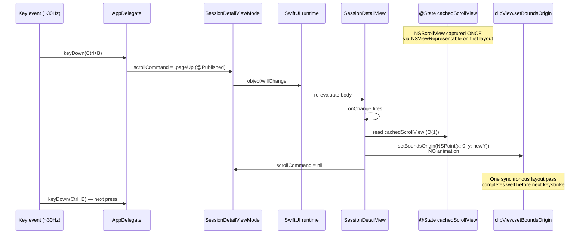

# Plan: Fix transcript view hang when holding Ctrl+B

## Context

User reports the Seshctl macOS app fully hangs (force-kill required) after holding `Ctrl+B` (page-up) in the transcript detail view for a few seconds, in transcripts with hundreds of turns. Investigation traces the hang to two collaborating issues in `SessionDetailView.scrollByPixels` that compound under macOS key-repeat (~30 Hz):

1. **Recursive NSView traversal per keystroke.** `findScrollView()` walks `NSApp.keyWindow.contentView` from scratch on every page/line scroll. With hundreds of `Markdown` views in the LazyVStack, the keyWindow subtree contains thousands of NSView descendants — and the walk runs ~30× per second while a key is held.
2. **Animation pile-up.** Each keystroke wraps the scroll in `NSAnimationContext.runAnimationGroup(duration: 0.08)`. Key repeat fires every ~33 ms, so a new 80 ms animation kicks off before the previous one finishes, queueing layout passes faster than they drain. Each new page-up reveals fresh rows, each row's `MessageBodyText` triggers a `swift-markdown-ui` parse on the main thread, the run loop falls behind, the app appears hung.

The goal is a **targeted** fix: eliminate the per-keystroke NSView walk and the animation pile-up. Heavier work (pre-rendering markdown, virtualizing/streaming the parser) is deferred — those are real wins, but they don't need to ship to unblock the user.

Out of scope for this plan:
- Markdown pre-rendering / AttributedString caching at parse time.
- Streaming/chunking `TranscriptParser.parse`.
- Removing the `@Published scrollCommand` round-trip between `AppDelegate` and `SessionDetailView` (a larger architectural change).
- Touching the `SessionListViewModel` 2-second refresh.

## Working Protocol
- Use parallel subagents for independent reads. The fix itself is small enough that a single implementer can do it sequentially.
- Mark steps done as you complete them.
- Run `make test` (subagent) after each step. Use a 30s timeout per AGENTS.md; `make kill-build` if a build hangs.
- Manual verification: `make install`, open the panel, drill into a Claude transcript with hundreds of turns, hold `Ctrl+B` for ~10 seconds. App must remain responsive.

## Overview

Two-part change to `Sources/SeshctlUI/SessionDetailView.swift`:

1. **Cache the backing `NSScrollView` once.** Hand it to SwiftUI via a tiny `NSViewRepresentable` that captures the scroll view on `makeNSView`/`updateNSView` and stores it in `@State`. Eliminates the recursive `NSView` walk on every keystroke.
2. **Drop the animation for keyboard-driven line/page scroll.** `setBoundsOrigin` directly, no `NSAnimationContext`. `top`/`bottom` jumps keep their existing `withAnimation(.easeOut)` — those don't key-repeat. Eliminates overlapping animations under key repeat.

These two together turn each `Ctrl+B` press from "walk thousands of NSViews + start an 80 ms animation that overlaps the next one" into "load a cached pointer + set a CGFloat origin." The hot path becomes a few function calls and one layout pass per keystroke.

## User Experience

1. User opens a Claude transcript with hundreds of turns.
2. User holds `Ctrl+B` to page up through the conversation.
3. The view scrolls one page per keystroke, **without lag, without queued animation overshoot, without hanging**. Each page jump is instant (no 80 ms ease-out) but feels acceptable because keystrokes are deliberate and the user expects rapid traversal when holding a key.
4. User releases `Ctrl+B`. The view sits exactly where the last keystroke landed it — no trailing animation finishing 80 ms later.
5. `g`/`g` (jump to top) and `G` (jump to bottom) still animate smoothly with the existing 0.05 s ease-out — those don't key-repeat so animation is fine.

No visible UI changes other than the change in animation behavior for line/page scroll. The footer help text stays the same.

## Architecture

### Current

Per `Ctrl+B` keystroke (key repeat ~30 Hz):

```mermaid
sequenceDiagram
    participant Key as Key event (~30Hz)
    participant AD as AppDelegate
    participant VM as SessionDetailViewModel
    participant SwiftUI as SwiftUI runtime
    participant SDV as SessionDetailView
    participant NSView as NSView tree walk
    participant Anim as NSAnimationContext

    Key->>AD: keyDown(Ctrl+B)
    AD->>VM: scrollCommand = .pageUp  (@Published)
    VM->>SwiftUI: objectWillChange
    SwiftUI->>SDV: re-evaluate body
    SDV->>SDV: onChange fires
    SDV->>NSView: findScrollView() — recursive walk<br/>from keyWindow.contentView
    NSView-->>SDV: NSScrollView (after walking thousands of nodes)
    SDV->>Anim: runAnimationGroup(duration: 0.08)<br/>setBoundsOrigin(...)
    Anim->>Anim: 80ms layout pass<br/>(reveals new rows, parses Markdown)
    SDV->>VM: scrollCommand = nil  (@Published again)
    VM->>SwiftUI: objectWillChange
    Note over Anim: ~33ms later, next keystroke arrives<br/>BEFORE current animation finishes
    Key->>AD: keyDown(Ctrl+B)
    Note over Anim,SwiftUI: Animations stack;<br/>main thread saturates
```

Cost per keystroke (held key, hundreds of turns visible):
- 2× full `SessionDetailView` body re-evaluation (one for `scrollCommand` set, one for the reset to `nil`).
- 1× recursive `NSView` walk from `keyWindow.contentView`.
- 1× `NSAnimationContext` 80 ms run that overlaps the next keystroke's animation.
- N× `MessageBodyText` body evaluations for any rows that LazyVStack reveals — each calls `Markdown(text)` which parses on the main thread.

After ~3 s of holding, dozens of overlapping animations + a backlog of NSView walks + markdown parses saturate the main run loop. App hangs.

### Proposed



Cost per keystroke after the fix:
- 2× full `SessionDetailView` body re-evaluation (unchanged — still the @Published round-trip cost, which is acceptable).
- **0× NSView walks** — the cached `NSScrollView` reference is read in O(1).
- **0× animation overlap** — `setBoundsOrigin` is synchronous; no concurrent animations queue up.
- N× `MessageBodyText` body evaluations on revealed rows (unchanged — still a real cost, but the main thread now has time to actually finish each layout pass before the next keystroke arrives).

### How the NSScrollView gets captured

A near-invisible `NSViewRepresentable` overlay (frame: 0×0, hidden) is inserted into the `ScrollView`'s subtree. On `makeNSView` / `updateNSView` it walks UP from `nsView.superview` looking for the enclosing `NSScrollView` and stores it in a binding (or via a coordinator) so `SessionDetailView`'s `@State` holds the reference. After the first lookup, `scrollByPixels` reads the cached pointer in O(1).

This is the standard SwiftUI introspection pattern. The walk runs once at view-instantiation time, not per keystroke. The walk is also UP from a known anchor point, not DOWN from `keyWindow.contentView`, so it's bounded by the SwiftUI view tree's depth (small) not the total NSView count.

## Current State

Key files and locations:

- **`Sources/SeshctlUI/SessionDetailView.swift:173-211`** — `scrollByPixels()` and the recursive `findScrollView()` / `findScrollViewIn()`. This is where the bug lives.
- **`Sources/SeshctlUI/SessionDetailView.swift:77-138`** — the `ScrollViewReader` / `ScrollView` / `LazyVStack` containing the transcript rows. The fix injects a `background { … }` view here to introspect and capture the `NSScrollView`.
- **`Sources/SeshctlUI/SessionDetailViewModel.swift:30-39`** — the `ScrollCommand` enum (`lineUp/Down`, `halfPage*`, `page*`, `top`, `bottom`). The fix differentiates animated vs. non-animated commands at the handler level — no enum change needed.
- **`Sources/SeshctlApp/AppDelegate.swift:392-448`** — `handleDetailKey` sets `vm.scrollCommand = .pageUp` etc. on each `keyDown`. Unchanged.
- **`Sources/SeshctlUI/MarkdownText.swift`** — `MessageBodyText` body uses `Markdown(text)` + `transcriptTheme` (computed property). Not touched in this plan but flagged as the second-order cost that benefits from this fix (fewer overlapping passes → fewer concurrent markdown parses).

No existing helper does NSScrollView introspection — this is the first place in the codebase that needs it. There is no shared `NSViewRepresentable` introspector to reuse; we'll add a small one local to `SessionDetailView.swift`.

## Proposed Changes

### 1. Capture NSScrollView once via NSViewRepresentable

Add a small `ScrollViewIntrospector: NSViewRepresentable` (private, local to `SessionDetailView.swift`) that:
- Creates a zero-size `NSView` and attaches it as a `.background { … }` of the SwiftUI `ScrollView`.
- On `updateNSView`, walks `nsView.enclosingScrollView` (Cocoa-native, single-hop pointer chain — not a recursive subview walk).
- Writes the resulting `NSScrollView?` into a `@State` binding owned by `SessionDetailView`.

The introspector runs once when the view is laid out. If the view re-lays out (window resize, etc.) it re-captures harmlessly. No per-keystroke work.

### 2. Replace `findScrollView()` with the cached reference

- Delete `findScrollView()` and `findScrollViewIn(_:)` (lines 199–211).
- In `scrollByPixels(command:)`, replace `guard let scrollView = findScrollView() else { return }` with `guard let scrollView = cachedScrollView else { return }`.

### 3. Drop animation for line/page scroll

In `scrollByPixels`, replace:
```swift
NSAnimationContext.runAnimationGroup { context in
    context.duration = 0.08
    clipView.animator().setBoundsOrigin(NSPoint(x: 0, y: newY))
}
```
with a direct, synchronous:
```swift
clipView.setBoundsOrigin(NSPoint(x: 0, y: newY))
clipView.documentView?.reflectScrolledClipView(clipView)
```

`reflectScrolledClipView` is the standard companion to a manual `setBoundsOrigin` — it tells the scroller knobs to update. Without it the visible scroll position changes but the scrollbar thumb stops tracking.

`top`/`bottom` (`proxy.scrollTo(...)` with `.easeOut`) is unchanged — those don't key-repeat.

### Complexity Assessment

**Low.** One file modified (`SessionDetailView.swift`), ~30 lines net change. No new dependencies, no new abstractions in `SeshctlCore`, no enum changes, no view-model changes. Regression risk is bounded to the transcript detail view's scroll behavior; the rest of the app (list view, settings, integrations) doesn't touch this code. The only subtle bit is the `NSViewRepresentable` introspector — first time this pattern is used in the codebase — but it's a well-known SwiftUI pattern and the implementation is ~20 lines.

The one thing to verify by hand: that `clipView.setBoundsOrigin` without animation matches the behavior of `clipView.animator().setBoundsOrigin` for keyboard scroll. Expected to be identical except for the 80 ms ease-out, which we want gone.

## Impact Analysis

- **New Files**: None.
- **Modified Files**:
  - `Sources/SeshctlUI/SessionDetailView.swift` — add introspector + `@State`, replace `scrollByPixels`, delete `findScrollView*`.
- **Dependencies**: None added or removed.
- **Similar Modules**: No existing NSView introspection in the codebase. `Sources/SeshctlUI/FollowSelectionScroll.swift` is the closest neighbor (it's a SwiftUI scroll helper) but it uses `ScrollViewProxy.scrollTo` only — no AppKit introspection — and there's nothing to share.
- **Tests to add**: `Tests/SeshctlUITests/SessionDetailViewModelTests.swift` covers the view model. The view itself has no test file today (UI views are exempt from the 60% coverage rule per AGENTS.md "View-only files (SwiftUI views) are exempt"). The fix is in a SwiftUI view's private method that calls AppKit APIs; we cannot unit-test it without harnessing an `NSWindow`. Verification is therefore manual + smoke-tested via the existing test suite to confirm no compile or behavior regressions land.

## Implementation Steps

### Step 1: Cache the NSScrollView reference on the view
- [x] Add `@State private var cachedScrollView: NSScrollView?` to `SessionDetailView`.

**Shipped deviation from the plan**: the original plan proposed an `NSViewRepresentable` introspector that captured the scroll view via `nsView.enclosingScrollView`. First implementation tried that, but `.background { introspector }` on a SwiftUI `ScrollView` placed the introspector's NSView as a SIBLING of the backing `NSScrollView` (not a child), so `enclosingScrollView` returned `nil` and keyboard scroll silently broke. Reverted to the recursive walk from `NSApp.keyWindow.contentView` but reused only on cache miss — the perf win is the same (one walk per view lifetime instead of per keystroke). See Suggestions section in `.agents/reviews/2026-05-26-1740-local-transcript-scroll-hang-r1.md` for the structural trade-offs.

### Step 2: Use the cached scroll view in scrollByPixels via lazy-init
- [x] In `scrollByPixels`, replace `guard let scrollView = findScrollView() else { return }` with a lazy-init: return cached if present; otherwise call `findScrollView()`, store the result, and use it; else return.
- [x] Keep `findScrollView()` and `findScrollViewIn(_:)` — they're called on cache miss (first keystroke per view lifetime), not deleted as the original plan suggested.

### Step 3: Drop animation for line/page scroll
- [x] In `scrollByPixels`, replace the `NSAnimationContext.runAnimationGroup { … }` block with `clipView.setBoundsOrigin(NSPoint(x: 0, y: newY))` followed by `scrollView.reflectScrolledClipView(clipView)` (correction: on the `NSScrollView`, not on `documentView` — that was a plan typo).
- [x] Leave the `withAnimation(.easeOut(duration: 0.05))` on `top`/`bottom` in `handleScroll` unchanged.

### Step 4: Verify by build + tests + manual hang repro
- [x] Run `swift test` (in a subagent). All 899 tests across 75 suites pass in 3.081s.
- [ ] Run `make install` and reproduce the original case: open a Claude transcript with hundreds of turns, hold `Ctrl+B` for ~10 seconds. The app must remain responsive throughout; release the key and the view must sit at the final position with no trailing animation overshoot. *(Manual — pending user.)*
- [ ] Sanity-check `j` / `k` / `Ctrl+D` / `Ctrl+U` / `Ctrl+F` / `Ctrl+B` each scroll by the expected amount, and that `g`/`g` and `G` still animate smoothly. *(Manual — pending user.)*
- [ ] Sanity-check the scrollbar thumb tracks the position after manual `setBoundsOrigin` (confirms `reflectScrolledClipView` is doing its job). *(Manual — pending user.)*

### Step 5: Tests
- [x] No new unit tests — the change is in a SwiftUI view that calls AppKit APIs, which the existing test rig can't exercise without an `NSWindow` harness. Manual verification per Step 4 is the test coverage.

## Acceptance Criteria

- [ ] [test-manual] Holding `Ctrl+B` for 10 seconds in a transcript with hundreds of turns does NOT hang the app. The view scrolls continuously while the key is held and stops at the final position when released.
- [ ] [test-manual] Holding `Ctrl+F`, `Ctrl+D`, `Ctrl+U`, `j`, `k`, arrow-up, arrow-down for several seconds each likewise does NOT hang the app.
- [ ] [test-manual] `g`/`g` (jump to top) and `G` (jump to bottom) still animate smoothly with the existing ~50 ms ease-out.
- [ ] [test-manual] The scrollbar thumb correctly tracks the visible position after keyboard scrolling.
- [ ] [test] `swift test --enable-code-coverage` passes — all existing tests still green; coverage of `Sources/SeshctlUI/SessionDetailView.swift` is unchanged or non-decreasing (the file's coverage is "exempt" per AGENTS.md, but the build itself must succeed and no view-model coverage may regress).

## Edge Cases

- **First keystroke before introspection completes.** If `cachedScrollView` is still `nil` on the very first `Ctrl+B`, `scrollByPixels` no-ops (the existing code already no-ops on `findScrollView() == nil`). The user's next keystroke ~33 ms later will succeed once the introspector has run. Acceptable — this is at most one missed frame of scroll.
- **Window changes (resize, full-screen).** `updateNSView` re-fires on layout changes; the cached pointer re-captures harmlessly. `enclosingScrollView` is stable across resizes anyway.
- **Detail view dismissed mid-animation.** No longer possible — there's no animation. Previously, a `top`/`bottom` jump could complete after the view was torn down; SwiftUI handles this gracefully because we use `proxy.scrollTo`, not the `clipView.animator()` path.
- **Markdown rendering still expensive.** This plan intentionally doesn't touch the markdown re-parse cost on revealed rows. After the fix, the user may still notice transient frame drops as `Ctrl+B` reveals new rows that haven't been parsed yet — but the run loop will drain between keystrokes instead of saturating. If profiling after the fix shows residual sluggishness, the follow-up is to pre-render markdown into `AttributedString` at parse time (background thread) and cache on the turn model. Out of scope here; track as a follow-up.
