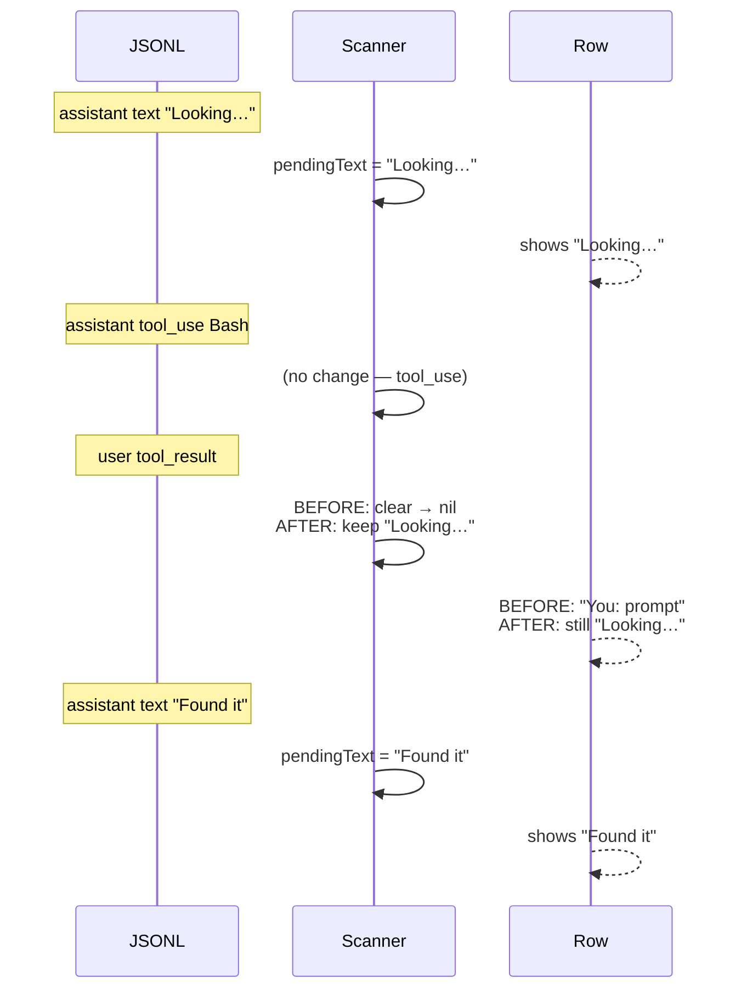

# Plan: Stop clobbering live assistant text on tool_result events

## Working Protocol
- Use parallel subagents for independent tasks (reading, searching, running tests).
- Mark steps done as you complete them — a fresh agent should be able to find where to resume.
- Run tests after each step before moving on. Per AGENTS.md: **always run tests via subagents**, with a 30s timeout. Run `make kill-build` first if anything looks stale.
- If blocked, document the blocker here before stopping.

## Overview
`TranscriptLatestAssistantScanner` treats every `type:"user"` event as a turn boundary, but Claude Code uses that type for both fresh prompts AND tool_result continuations. The latter aren't real turn boundaries, so the row preview regresses mid-turn from a meaningful narration ("Looking at the auth file…") to `You: <stale prompt>` between a tool firing and the next text block landing. Fix: only clear `pendingText` for events that look like fresh prompts, not tool_result continuations.

## User Experience
Today, during a tool-heavy Claude turn, the row preview can flicker:

```
You: prompt          → "Looking at the auth file…" → (tool runs)
→ You: prompt        ← regression while tool_result is the latest event
→ "Found it: …"      ← next text block lands
```

After the fix the row stays on `"Looking at the auth file…"` until the next text block replaces it. Tool chains (multiple tools back-to-back with no narration between them) keep the previous text instead of dropping to the stale prompt.

The fresh-prompt case is unchanged: typing a new prompt mid-turn still clears the scanner so the row shows `You: <new prompt>`.

## Architecture

### Current
Scanner iterates JSONL line-by-line. On `type:"user"` it unconditionally clears `pendingText`. The transcript content distinction (fresh prompt vs tool_result) is ignored.

### Proposed
On `type:"user"`, peek at `message.content`:
- String content, or array with any non-`tool_result` block → fresh prompt → clear `pendingText` (existing behavior).
- Array where every block is `type:"tool_result"` → continuation → leave `pendingText` alone.
- Missing/malformed content → treat as fresh prompt (safer; preserves invalidation).

No new files, no new public API, no changes to caller (`SessionListViewModel`) or consumers. The scanner is a pure function in `SeshctlCore`; the bug fix is entirely inside `extractLatestAssistantText(transcript:)`.



## Current State
- `Sources/SeshctlCore/TranscriptLatestAssistantScanner.swift` — single-function scanner, ~100 lines. The `else if type == "user"` branch (lines 92-94) is the entire bug surface.
- `Tests/SeshctlCoreTests/TranscriptLatestAssistantScannerTests.swift` — 15 tests. Two are adjacent:
  - `returnsNilWhenUserTurnFollowsLatestAssistant` (line 87) — uses string content (fresh prompt). Stays green.
  - `surfacesNextAssistantTextAfterToolResult` (line 96) — uses tool_result content. Assertion stays green; docstring needs updating.
- `Sources/SeshctlCore/TranscriptParser.swift:336-338` — reference disambiguation for the same JSONL shape (used for the transcript detail view, different purpose).
- `AGENTS.md:185` — "Transcript-Derived Row Signals" paragraph describing the user-event invalidation rule.
- Original feature plan: `.agents/plans/2026-05-25-0107-live-assistant-row-recap.md`.

## Proposed Changes
Inline a 3-line content-shape check in the scanner's user branch. No shared helper, no API changes.

### Complexity Assessment
**Trivial.** One source file, one test file, one docstring update in source, one paragraph update in AGENTS.md. The change is ~5 lines of executable code. No new types, no new public API, no consumer impact. Regression risk is contained to the scanner itself; existing tests cover the fresh-prompt boundary and the next-text-after-tool_result repopulation, and three new tests pin the fix.

## Impact Analysis
- **New Files**: none.
- **Modified Files**:
  - `Sources/SeshctlCore/TranscriptLatestAssistantScanner.swift` — logic + rule-2 docstring.
  - `Tests/SeshctlCoreTests/TranscriptLatestAssistantScannerTests.swift` — three new tests, one docstring update.
  - `AGENTS.md` — update the "Transcript-Derived Row Signals" paragraph (~line 185).
- **Dependencies**: none added.
- **Consumer impact**: `SessionListViewModel.refresh()`'s `transcriptLatestAssistantCache` and `latestAssistantById` keep working unchanged — they just see slightly different (more often non-nil) results.
- **Similar Modules**: `TranscriptParser.extractUserText` (different purpose: extracts user prompt text for the detail view, returns nil for all-tool_result messages — we reuse the *idea*, not the function).

## Key Decisions
- **Inline check, not shared helper.** Three lines, semantics differ from `TranscriptParser.extractUserText` (we want a boolean, the parser wants stripped text). Re-evaluate if a third caller appears.
- **Existing `surfacesNextAssistantTextAfterToolResult` test stays.** Assertion is correct under the new behavior; only its docstring describes the old mechanism. Update the docstring; keep the name (it accurately describes the observable behavior: "next assistant text wins").
- **Missing/malformed user content defaults to fresh prompt.** Safer fallback — preserves today's clearing behavior in the rare malformed case rather than silently keeping stale text.

## Implementation Steps

### Step 1: Fix the scanner
- [ ] In `Sources/SeshctlCore/TranscriptLatestAssistantScanner.swift`, change the `else if type == "user"` branch to inspect `message.content`:
  - String content → clear (fresh prompt).
  - Array content where every block has `type == "tool_result"` → leave `pendingText` alone (continuation).
  - Anything else (array with text/image, missing content, malformed) → clear (fresh prompt; safe default).
- [ ] Update the rule-2 docstring (file header, lines 36-39) to spell out the fresh-prompt vs tool_result distinction. Add a brief note about the rationale (Claude is still mid-turn during tool_result).

### Step 2: Tests
- [ ] In `Tests/SeshctlCoreTests/TranscriptLatestAssistantScannerTests.swift`, add:
  - `keepsLatestAssistantWhenToolResultFollowsIt` — assistant text → user/tool_result → returns the text.
  - `clearsLatestAssistantWhenFreshUserPromptFollowsIt` — assistant text → user with string content "actually do this instead" → nil. (Mostly duplicates the existing `returnsNilWhenUserTurnFollowsLatestAssistant` but pins it under the new naming for symmetry with the keep-case.)
  - `keepsLatestAssistantAcrossInterleavedToolResults` — text → tool_use → tool_result → tool_use → tool_result → returns the original text.
- [ ] Update the docstring on `surfacesNextAssistantTextAfterToolResult` (line 98-100) to describe the new mechanism: "text survives the tool_result and is overwritten by the next assistant text block."

### Step 3: Docs
- [ ] Update `AGENTS.md` line 185 paragraph: the sentence beginning "it returns `nil` when a `user` event lands after the latest assistant text" needs to clarify that only fresh-prompt user events clear; tool_result user events preserve the text.

### Step 4: Build + test
- [ ] `swift build` (timeout 120s; run `make kill-build` first if anything's stale).
- [ ] `swift test --filter TranscriptLatestAssistantScannerTests` (timeout 30s) — via subagent per AGENTS.md.
- [ ] Full `swift test` to make sure no consumers regressed.

## Acceptance Criteria
- [ ] [test] `keepsLatestAssistantWhenToolResultFollowsIt` passes.
- [ ] [test] `keepsLatestAssistantAcrossInterleavedToolResults` passes.
- [ ] [test] `clearsLatestAssistantWhenFreshUserPromptFollowsIt` passes (fresh-prompt boundary still works).
- [ ] [test] Existing `surfacesNextAssistantTextAfterToolResult` still passes (next-text-wins is unchanged).
- [ ] [test] Full `swift test` suite is green.
- [ ] [test-manual] Smoke a long tool-heavy Claude turn in seshctl and confirm the row stays on Claude's latest narration instead of dropping to `You: <prompt>` between tool calls.

## Edge Cases
- **User event with `content: []`** → treated as fresh prompt (default-clear). Theoretical; not observed in practice.
- **User event with mixed `[text, tool_result]` blocks** → treated as fresh prompt. Conservative: if the user typed anything alongside a tool_result-bearing wrapper, that's a real interruption worth showing.
- **Repeated tool_result chains spanning many seconds** → the test `keepsLatestAssistantAcrossInterleavedToolResults` covers this; the row will pin on the prior text for as long as the chain runs.
