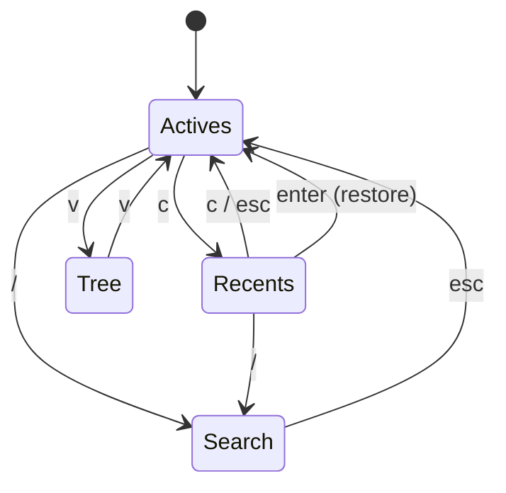
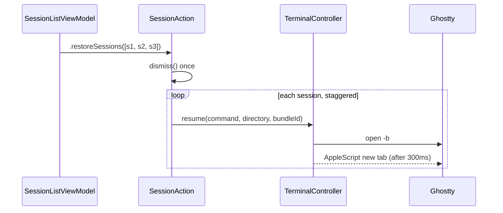

# Plan: Recently-closed sessions with multi-select restore

## Working Protocol
- Use parallel subagents for independent tasks (reading, searching, running tests).
- Mark steps done as you complete them. A fresh agent should be able to find where to resume.
- Run tests after each step before moving on. Per AGENTS.md: **always run tests via subagents**, with a 30s timeout. Run `make kill-build` first if anything looks stale.
- If blocked, document the blocker here before stopping.

## Overview

Restore a set of closed sessions after a terminal restart. The user quits Ghostty with several agents running. Seshctl should offer those sessions back, let the user select them, then reopen each one in a new Ghostty tab.

Most of the machinery exists. `SessionAction.resumeInactiveSession` already builds `claude --resume <id>` / `codex resume <id>` / `pi --session <id>` and dispatches it into a new Ghostty tab. `reapStaleSessions` already flips hard-closed rows to `.stale`. `gc` already retains closed rows for 30 days. `recentRows` already computes the list. `SessionListView` already renders a "Recent" section header.

Four things are missing:

1. Rows are duplicated per conversation, so a recents view would show dead twins.
2. `filteredRows` hides `recentRows` unless the search bar is open, so the only path in is `/`.
3. Restore is one row at a time, and each restore dismisses the panel.
4. The agent's conversation id is never displayed.

## Evidence

Measured against the live database at `~/.local/share/seshctl/seshctl.db` on 2026-08-03:

| Metric | Value |
|---|---|
| Total session rows | 217 |
| Distinct conversation ids | 133 |
| Duplicate rows | 39% |
| Rows in the 50-row UI window | 50 |
| Distinct conversations in that window | 33 |

One conversation holds 5 rows. Two of them still report `idle` with different pids. The conversation id round-trips across resume for both Claude and Codex, so it is a valid dedup key.

## User Experience

### Today

```
⌘⇧S  →  active sessions only
/    →  search bar opens, recents appear mixed with actives
enter → resumes one row, panel dismisses
```

Restoring five sessions costs five hotkey presses. Closed sessions are only reachable by typing.

### After

```
⌘⇧S  →  active sessions only            (unchanged)
c    →  recents mode, closed sessions, newest first
space → mark the selected row
a    →  mark all / unmark all
enter → restore every marked row in its own Ghostty tab, dismiss once
c    →  back to actives, marks cleared
```

With nothing marked, `enter` restores the selected row only. That keeps the single-row path identical to today.

Each row shows the first 8 characters of the conversation id. The detail view (`o`) shows the full id.

## Architecture

### Dedup

Two layers. The query layer fixes what the user sees. The write layer stops the growth.

**Query-time.** New `Database.listRecentSessions(limit:)` returns the newest row per `(conversation_id, tool)`. Rows with a NULL conversation id pass through unchanged, keyed by their own id. This does not delete anything, so it is reversible.

**Write-time.** The pid-keyed `startSession` (`Sources/SeshctlCore/Database.swift:281`) already ends active rows sharing the pid. Extend it to delete *inactive* rows sharing `conversation_id` + `tool` before the insert. Active rows are never touched, so a genuine second live session on the same conversation still gets its own row.

The 50-row budget in `refresh()` (`SessionListViewModel.swift:290`) is shared by actives and recents. Recents mode needs its own query and its own limit.

### Recents mode

`isRecentsMode` joins `isSearching` and `isTreeMode` as a view mode on `SessionListViewModel`. `filteredRows` (`:504`) gains one branch. The three modes are mutually exclusive: entering search or tree mode clears recents mode.



Search mode keeps its current behavior of showing actives plus recents together. Recents mode shows recents only.

### Multi-select

`markedSessionIds: Set<String>` on the view model. A row can only be marked when `TerminalController.buildResumeCommand` returns non-nil for it. Cursor rows and rows with no conversation id refuse the mark rather than fail at restore time.

`a` toggles between "all markable rows" and "none". One key covers both directions.

Marks clear on: leaving recents mode, entering search, panel dismiss, and a completed restore.

### Multi-restore

New `SessionActionTarget` case: `.restoreSessions([Session])`. AGENTS.md requires every action to route through `SessionAction.execute`, so this belongs beside the existing cases rather than in the view model.

Serialization is required. `TerminalController.resume` runs `open -b` then an AppleScript against "front window" after a 300ms delay (`TerminalController.swift:912`). Firing N of those concurrently makes them race for the same front window. The restore walks the list with a staggered delay per session.



The stagger interval needs empirical tuning. Start at 600ms and verify with 5 sessions in a freshly-launched Ghostty. Sessions can span different host apps, so the walk stays globally serial rather than per-app.

Failures stay silent per session, matching the existing single-row behavior. A session whose directory no longer exists is skipped by `TerminalController.resume`, which already guards on `FileManager.fileExists`.

### Conversation id display

`Session.conversationId` is the agent's own id and the argument every `--resume` form takes. `Session.id` is a local UUID with no meaning outside the database, so it stays hidden.

- Row: first 8 characters, monospaced, tertiary color, suppressed when nil.
- Detail header: full id beside the existing directory and branch fields (`SessionDetailView.swift:18`).

## Steps

### Step 1: Dedup — done
- [x] `Database.listRecentSessions(limit:)` keeps the newest row per `(COALESCE(conversation_id, id), tool)`.
- [x] `Database.collapseInactiveTwins` deletes closed twins on start, wired into both `startSession` variants.
- [x] The new row inherits the collapsed twin's `title`, so a resume no longer discards it.
- [x] `listRecentSessions` also excludes conversations that have a live row.
- [x] 12 tests in `Tests/SeshctlCoreTests/DatabaseTests.swift`.

Two things changed from the written plan:

- **Collapse had to run before the end-actives loop.** Placed after, it deleted the row the same call had just closed, which broke the documented "ended, not erased" contract of `startSession(conversationId:tool:)`. An existing test caught it.
- **The live-twin exclusion was not in the plan.** It replaces the destructive alternative: rather than deleting a closed row whose conversation went live again, the query hides it.

### Step 2: Recents mode — done
- [x] `isRecentsMode` on `SessionListViewModel`, with `enterRecentsMode()` / `exitRecentsMode()` / `toggleRecentsMode()`.
- [x] Branch in `filteredRows`; `listRecentSessions` wired into `refresh()`.
- [x] Cleared by `enterSearch`, `toggleViewMode`, and `panelDidHide`.
- [x] `case (_, "c")` in `handleNormalKey`. `esc` / `q` back out of recents before closing the panel.
- [x] `.recentsOnly` now names `c`; new `.noRecents` empty state.
- [x] `SessionListView` zeroes `activeCount` in recents mode, so closed rows don't inherit the live sessions' age buckets.
- [x] `HelpPopover` gained `c` under "View" plus a "Recents" section.
- [x] Rebound off `R` after review: `r` cycles the source filter, so a shift pairing implied a relationship that does not exist. `c` is for "closed".

### Step 3: Multi-select — done
- [x] `markedSessionIds` plus `toggleMarkForSelected()`, `toggleMarkAll()`, `clearMarks()`, `isMarkable()`, `markableRows`.
- [x] Unmarkable rows refuse the mark and draw a dimmed `square.slash`.
- [x] `space` and `a` bound in `handleNormalKey`.
- [x] `refresh()` prunes marks whose row disappeared.

### Step 4: Multi-restore — done
- [x] `.restoreSessions([Session])` on `SessionActionTarget`.
- [x] `dispatchRestores` walks recursively with `restoreStagger`, carrying failures as a parameter.
- [x] `enter` in recents restores the marked set, or the selected row when nothing is marked.
- [x] A single session falls through to the existing one-row path, so behaviour outside recents is unchanged.
- [x] Failed commands pool and copy to the clipboard once at the end.
- [ ] **Stagger not yet measured.** Still the 0.6s guess. See Open questions.

### Step 5: Conversation id display — done
- [x] First 8 characters in `SessionRowView`, recents mode only.
- [x] Full id in the `SessionDetailView` header, selectable.
- [x] `SessionDetailViewModel.conversationId` falls back to the recall result's session id.

### Step 6: Codex recall resume — done
- [x] `RecallService.resumeCommand` emitted `codex --resume <id>`. `codex resume --help` documents `codex resume [OPTIONS] [SESSION_ID]`, so the flag form was rejected. Now matches `TerminalController.buildResumeCommand`.

## Round 2: feedback after first use

Five changes after using the shipped build.

- **`x` also marks.** `requestKill` guards on `session.isActive`, so `x` was inert in recents. Both `space` and `x` now mark.
- **Recents is local-only.** `filteredRows` returns `recentLocalRows`, not `recentRows`. Disconnected cloud rows were showing up unmarkable, and they reopen in a browser rather than a tab. `sourceFilter` is ignored here.
- **`c` reloads on entry.** `enterRecentsMode` calls `refresh()`, so a terminal quit a moment earlier is listed at once instead of on the next 2-second tick.
- **Unread is suppressed in recents.** It means "has this said something since I last looked", which is meaningless for a stopped session.
- **Tree mode survives a trip through recents.** This was a regression, not a gap. `isTreeMode`'s `didSet` persists to UserDefaults, so `enterRecentsMode` assigning `false` overwrote the user's saved grouping permanently, across relaunch. Now stashed in `treeModeBeforeRecents`, written through `setTreeModeWithoutPersisting`, restored on every exit path. `toggleViewMode` restores before toggling, so `v` flips the real preference.

- **Recents lists only restorable rows.** Rows with no conversation id, and Cursor rows, are filtered out rather than shown with a refusing checkbox. 40 of 169 closed rows in the live database had no conversation id. They stay reachable through `/` search.

Confirmed not a bug: the active view already shows only active rows, in both list and tree mode. All nine active rows in the live database had live pids. The one way it breaks is a ghost whose pid was recycled, which the README documents.

## Round 3: searching inside recents

The question asked was what a recents search should read: semantic recall (the shipped `SeshctlRecall`, cass's equivalent) or the row fields. Answer: the row fields.

A `RecallResult` is a transcript hit, not a session row. It cannot be marked or reopened, and joining it back to a closed session by conversation id only reorders rows `recentLocalRows` already lists. Recall also embeds the query and may index transcripts first, which is the wrong cost for narrowing a visible list per keystroke. Global `/` search already spans recents with recall attached, so the discovery path exists. `c` plus a query is the narrowing path.

Measured against the live database first. Of the 100 rows recents displays: 59 have a title, 64 have a repo, 71 have a `last_ask`. The 29 with neither title nor repo are `/Users/patoms`, `/`, and rows whose first prompt is "Below is the start of a coding…", which are piped or sub-agent sessions nobody restores. The rows worth finding all carry a title or a repo.

- **Token AND, not fuzzy.** The single `contains` over the whole query needed the words adjacent in one field, so `sesh dedup` matched nothing. Now every whitespace-separated token must hit some field. Fuzzy subsequence matching was rejected: at 100 rows it buys `sctl` → `seshctl` and costs false positives on three-letter tokens. Narrowing comes from the second word, not from a looser first one. `loc` alone left 46 rows, `loc 519` leaves one.
- **`/` keeps recents open.** `enterSearch` only clears the mode when it was not already on. Checkboxes, `a`, and `enter` stay live.
- **Recall is skipped in recents.** `triggerRecallSearch` guards on `!isRecentsMode`.
- **Marks outlive the query.** `sessionsToRestore` resolves against `recentSessions` rather than the visible rows.
- **`toggleMarkAll` composes.** It unions the visible rows in, or subtracts them when all are already marked. It used to assign the visible set outright, which made `a` under one query undo `a` under the last one. This was a real bug the new tests caught, not a stale expectation.
- **Marking moved behind `tab`.** Search mode sends every letter to the query, so `x` / `a` / space join `j` / `k` / `o` in the existing navigation branch.
- **`.noRecentsMatch`.** Its own empty state, because the fix is to clear the query rather than leave the view.

## Verification

- Full suite: 1094 tests, passing.
- New tests: 12 in `DatabaseTests`, 24 in `RecentsModeTests`, 10 in `RestoreDispatchTests`. The two new suites ran 5 times with no flake.
- Coverage of changed files: `Database.swift` 98.15%, `SessionAction.swift` 92.63%, `SessionListViewModel.swift` 81.90%, `SessionDetailViewModel.swift` 73.58%, `RecallService.swift` 90.26%. All above the 60% floor.
- `SessionListViewModelTests`' recall-search tests flake roughly 2 runs in 5 under full-suite parallel load. They are unrelated to this work: the file is untouched, the tests never call `refresh()`, and the polling helper's own comment documents the flakiness as a known condition.

## Dedup, checked against real data

Reported as suspect: two active signal-intelligence sessions alongside two closed ones in the same repo. Dedup is correct. The four rows carry four different conversation ids, and each has its own transcript with a distinct `sessionId` and a null `parentUuid`. They are independent chats that share a directory, so there is nothing to merge. Dedup keys on conversation, not on directory.

The same check confirmed the premise the collapse rests on: `claude --resume <id>` preserves the conversation id. The live database holds conversations with five rows across five different pids.

## Open questions

- **Resolved: the `idle` twins.** All nine pids in the live database were alive. `reapStaleSessions` is correct. Two live rows sharing a conversation id is legitimate, because `--resume` works against a running conversation. This is why collapse only ever touches inactive rows.
- **Stagger interval.** 0.6s is still a guess. Measure it against 5 real sessions in a freshly-launched Ghostty and adjust `SessionAction.restoreStagger`.
- **`.stale` versus `.completed`.** A hard-closed terminal produces `.stale`, a clean quit `.completed`. The terminal-restart case is entirely `.stale`. Ranking stale first, or scoping `a` to stale rows, may fit the intent better than a flat select-all. Not implemented.

## Not doing

- **A tab bar.** No tab infrastructure exists. `isTreeMode` and `isSearching` already establish the mode pattern. `c` fits it.
- **Adopting cass.** `cass` (Dicklesworthstone/coding_agent_session_search) is a passive transcript indexer. Its README states it does not manage session state. It carries no pid, host app, window id, or status, which are the only fields this feature needs. Its real overlap is with `SeshctlRecall`, and adopting it would add an external binary the DMG cannot ship. That trade is worth its own discussion, separate from this feature.
- **Adopting cass_memory_system.** A procedural memory playbook of rules with confidence decay. Unrelated to session lifecycle.

## Test Coverage

Per AGENTS.md, verify coverage after each step:

```bash
swift test --enable-code-coverage
jq '[.data[0].files[] | select(.filename | contains("/Sources/")) | {file: (.filename | split("/Sources/")[1]), pct: (.summary.lines.percent * 100 | round / 100)}]' "$(swift test --show-codecov-path)"
```

Files touched that must not drop below 60%: `Database.swift`, `SessionListViewModel.swift`, `SessionAction.swift`. `SessionRowView.swift` and `SessionDetailView.swift` are view-only and exempt.
