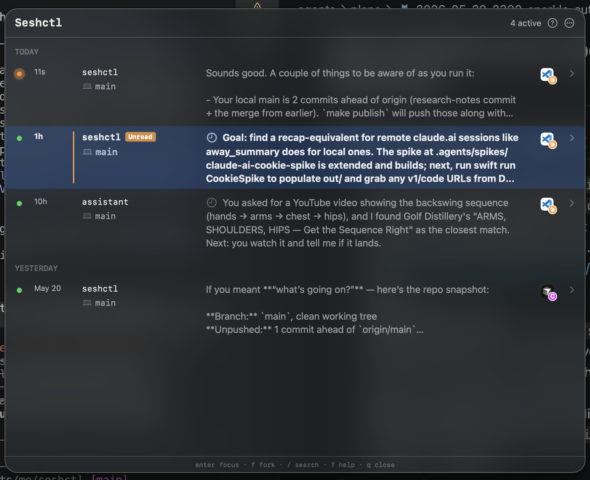

# Seshctl

A macOS session manager for terminal-based workflows. Tracks coding sessions across Terminal.app, iTerm2, VS Code, Cursor, Warp, Ghostty, and cmux, with a native menu bar app and CLI.



## Requirements

- macOS 13+
- Optional: [jq](https://jqlang.github.io/jq/) — used by the standalone `seshctl-uninstall` fallback for robust JSON edits

## Install

1. Grab the latest `Seshctl-X.Y.Z.dmg` from the [releases page](https://github.com/julo15/seshctl/releases/latest).
2. Open the DMG and drag `Seshctl.app` to `/Applications`.
3. **First launch only** — Seshctl is self-signed (not yet notarized with an Apple Developer ID), so the first time you double-click it macOS will block it with *"Apple could not verify 'Seshctl' is free of malware"*. Unblock with one of:
   - **System Settings → Privacy & Security**, scroll to the bottom, click **Open Anyway** next to the "Seshctl was blocked" row, then re-launch Seshctl and confirm the second prompt.
   - Or run `xattr -d com.apple.quarantine /Applications/Seshctl.app` in Terminal, then double-click.

   After this once, future launches and Sparkle auto-updates are silent — macOS remembers the bypass per signing identity.
4. Grant Accessibility when prompted on first launch — the system permission window can open behind the active app, so Cmd+Tab if you don't see it.

The app auto-updates over Sparkle. You can also trigger a check from the menu-bar gear → **About** → **Check for Updates…**.

### Migrating from 0.3.0

0.3.0 doesn't bundle the auto-updater, so the one-time transition to 0.4.0 is manual. From here on every release lands inside the app with a one-click **Install Update** prompt.

1. Quit Seshctl (menu-bar icon → Quit, or `pkill -f SeshctlApp`).
2. Download the latest DMG from the [releases page](https://github.com/julo15/seshctl/releases/latest).
3. Open the DMG and drag `Seshctl.app` over `/Applications` (replace the existing one).
4. Unblock the first launch — see step 3 of [Install](#install) above (System Settings → Privacy & Security → Open Anyway, or `xattr -d com.apple.quarantine /Applications/Seshctl.app`).
5. Press **Cmd+Shift+S** to confirm the panel comes up.

Existing Automation, Accessibility, and claude.ai grants persist — same signing identity, so TCC carries them across. The welcome panel won't reappear; the launch-time reconciler silently refreshes the CLI symlink, hooks, and editor extensions.

## Usage

Press **Cmd+Shift+S** to toggle the session panel.

### Session list

- **j / k** or **Arrow keys** — navigate sessions
- **gg** — jump to top
- **G** — jump to bottom
- **Enter** — focus the selected session's terminal
- **f** — fork the selected Claude session into a new branched session in a new tab (then **y** to confirm, **n** to cancel)
- **o** — open session detail view
- **x** — kill session process (then **y** to confirm, **n** to cancel)
- **u** — mark the selected session as read
- **U** — mark all sessions as read (then **y** to confirm, **n** to cancel)
- **r** — cycle the source filter: all → local only → cloud only → all
- **v** — toggle list/tree view
- **h / l** — in tree mode, jump to previous/next group
- **/** — search/filter sessions
- **?** — open the keyboard help popover
- **q** or **Esc** — dismiss the panel

### Keeping the panel open

By default the panel behaves like Spotlight: it floats above everything and dismisses itself as soon as you focus another window. Two settings under **⋯ → Appearance** change that:

| Setting | Effect |
|---|---|
| **Keep panel open** | The panel stops dismissing when it loses focus, so you can park it on a spare monitor as an always-on dashboard. **Cmd+Shift+S** then brings it forward when it doesn't have focus, and hides it only when it does. |
| **Always in front** | Holds the open panel above every other window. Off lets other windows cover it, like an ordinary window. Only applies with **Keep panel open** on — a transient panel is always in front. |

Drag the panel's edges to resize it. Position and size are both remembered, including which display, so it reopens where and how you left it rather than centered on whichever screen is currently active.

Seshctl now appears in the Dock and in Cmd+Tab. Switching to it shows the panel, since the app owns no ordinary window.

### Session detail

- **j / k** or **Arrow keys** — scroll line by line
- **gg** — jump to top
- **G** — jump to bottom
- **Ctrl+d / Ctrl+u** — half-page down/up
- **Ctrl+f / Ctrl+b** — full page down/up
- **q** or **Esc** — back to list

## Claude remote sessions

Seshctl can list Claude Code sessions hosted on claude.ai (Cowork) alongside local ones, and pair a local CLI with its claude.ai counterpart so Enter focuses the terminal. Connecting is a one-time manual flow:

1. Open the panel (**Cmd+Shift+S**) → click **⋯** in the header (or **Cmd+,**) to open Settings.
2. Click **Connect…**. A sign-in window opens on `claude.ai/login`.
3. **Sign in with email, not Google** — the embedded WebView blocks Google's flow. Enter your email to request a magic link.
4. The magic link opens in your default browser, not the sheet. Instead, **right-click → Copy Link Address** in your mail client.
5. Paste the URL into the **Paste magic-link URL** field at the top of the sheet and press Enter. Auth completes and the sheet dismisses.

Once connected, remote sessions appear with a cloud glyph. Each remote row previews the latest assistant message, refreshed every 30 seconds. The connection lasts until the cookie expires (~28 days) or you click **Disconnect**.

Accounts with Google-only sign-in: add an email/password or passkey on claude.ai first, then use that here.

## Compatibility

### LLM tools

| Tool | Hooks | Transcript | Notes |
|---|---|---|---|
| Claude Code | Full | Full | Bridged claude.ai sessions show as a single row with a cloud glyph |
| Codex | Partial | Full | No `UserPromptSubmit` (no "In Progress" state); no `SessionEnd` (closes on `Stop` only) |
| Cursor (1.7+) | Full | None | Workspace focus works out of the box; chat-thread focus needs the bundled companion extension (auto-installed from the in-app **Editor Integrations** window) |
| Gemini | None | None | CLI-only tracking via `seshctl-cli start --tool gemini` |

### Terminal apps

| App | Focusing | Notes |
|---|---|---|
| Terminal.app | Full | TTY-based tab matching |
| iTerm2 | Full | TTY-based tab matching, not extensively tested |
| Ghostty | Full | Working-directory matching; resume via surface configuration |
| Warp | Full | DB-assisted tab matching; resume via keystroke simulation. No split-pane support |
| cmux | Full | Two-level focus (workspace + surface). Same-pane fork requires opt-in — see [cmux setup](#cmux-setup) |
| VS Code | Full | Companion extension auto-installed from **Editor Integrations** |
| Cursor | Full | Companion extension auto-installed from **Editor Integrations** |
| Conductor.build | None | No AppleScript / URI / extension API exposed |
| Other | Basic | Window-name matching via System Events fallback |

The first time Seshctl focuses a session in an AppleScript-driven terminal or browser, macOS prompts for Automation permission for that target. Grants persist across updates — same code-signing identity, so TCC caches each grant by signature.

#### cmux setup

cmux's in-pane fork drives cmux's CLI over a Unix socket gated by `socketControlMode: "cmuxOnly"` by default. SeshctlApp isn't a descendant of the cmux GUI process, so the default mode blocks it and fork silently falls through to opening a new workspace.

To enable in-pane fork, edit `~/.config/cmux/cmux.json`:

```jsonc
{
  "$schema": "https://raw.githubusercontent.com/manaflow-ai/cmux/main/web/data/cmux.schema.json",
  "schemaVersion": 1,
  "automation": {
    "socketControlMode": "automation"
  }
}
```

Restart cmux. `automation` keeps the socket at `0600` (only your user can connect) and disables the ancestry check — the recommended mode.

Verify:

```sh
ls -la ~/Library/Application\ Support/cmux/cmux.sock
# expect: srw------- (automation) or srw-rw-rw- (allowAll)
env -i HOME=$HOME PATH=$PATH /Applications/cmux.app/Contents/Resources/bin/cmux ping
# expect: PONG
```

### Browsers

Seshctl reuses a single tab when flipping between remote Claude sessions across these browsers (falls back to opening a new tab in your default browser if no match is found).

| Browser | Focus existing tab | Notes |
|---|---|---|
| Chrome | ✅ | AppleScript |
| Arc | ✅ | Multi-window focus uses Accessibility `AXRaise` — without the grant, the right tab is selected but the wrong window may stay frontmost |
| Safari | ✅ | AppleScript |

## Uninstall

From the menu-bar icon (or the **⋯** menu in the panel) → **Uninstall Seshctl…**. Tick **Also delete session history** if you want the DB removed. Then drag `Seshctl.app` to Trash. The CLI symlink, hook entries, standalone uninstaller, install marker, and `codex_hooks` flag all clean up automatically.

Terminal equivalents (same cleanup):
- `seshctl uninstall` (add `--delete-history` for the DB)
- `seshctl-uninstall` (real file in `~/.local/bin/` — survives even if you trashed the app first)

If you just drag-to-trash and forget: hook scripts no-op when `seshctl-cli` isn't on PATH, and self-clean from settings after 5 consecutive misses. The user data DB at `~/.local/share/seshctl/seshctl.db` stays — remove manually if you don't want it.

## Development

```sh
make install        # build + sign + install into /Applications and re-launch (canonical dev loop)
make test           # run all tests
make kill-build     # force-kill stale SwiftPM processes if a build hangs
make help           # see all available commands
```

`make install` is the canonical inner loop: it rebuilds the universal binary, signs it with the self-signed cert (run `make cert-setup` once if you haven't), and AppDelegate's launch-time reconciler refreshes the CLI symlink, the standalone uninstaller, and hook registrations automatically.

For cutting releases, see [`docs/release.md`](docs/release.md). For codebase conventions and how to add new LLM tools, terminal apps, or browsers, see [`AGENTS.md`](AGENTS.md).
